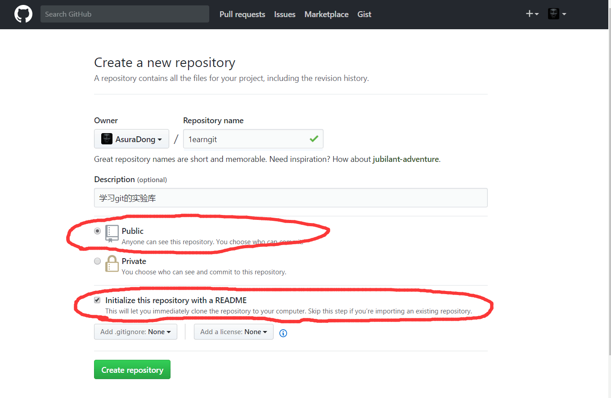
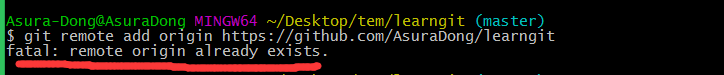

[toc]

## 创建远程仓库
首先在GitHub上创建一个仓库命名为learngit。选中public（private要钱），选中 生成README（就是markdown形式的说明文档），便于别人和自己了解仓库的作用。（附截图）

## 克隆远程仓库
切到工作目录下，执行`git clone https://github.com/AsuraDong/learngit.git` 就可以克隆到本地了。

这时候文件名默认是仓库名字，如果想改名字可以：`git clone https://github.com/AsuraDong/learngit.git learngit_2`，即在后面加一个参数做文件名字。

## 修改远程仓库

### 连接远程仓库
如果是第一次执行：`git remote add origin https://github.com/AsuraDong/learngit`即可。如果之前操作过别的远程仓库会出现下面的报错：（附截图）

**解决方法：先删除远程 git 仓库，再添加**
> `git remote rm origin`：删除远程 git 仓库 
`git remote add origin https://github.com/AsuraDong/learngit`：再添加

### 推送当前分支

*分支的概念之后记录，现在可以理解成主分支：master；远程库的名字叫做：origin（Git默认叫法）*

`git push -u origin master`:将本地的master分支推送到origin主机，同时指定origin主机为默认主机，之后就可以省略参数直接使用：`git push`

当然可以每次都这样：`git push origin master`。

**所以，`-u`参数主要是针对多个主机的情况下，指定默认主机。**如果想了解更详细，可以[点击这里](https://www.zhihu.com/question/20019419)