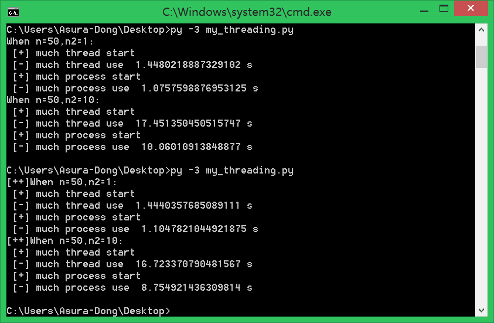
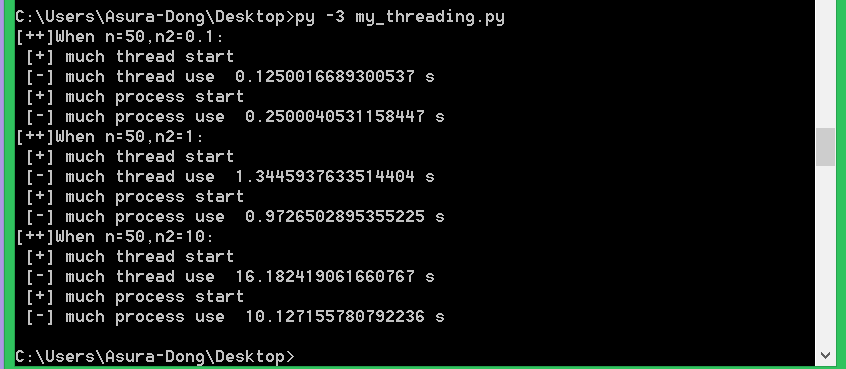

[toc]

# python多进程和多线程谁更快

- python3.6
- threading和multiprocessing
- 四核+三星250G-850-SSD

> 自从用多进程和多线程进行编程,一致没搞懂到底谁更快。网上很多都说python多进程更快，因为GIL(全局解释器锁)。但是我在写代码的时候，测试时间却是多线程更快，所以这到底是怎么回事？最近再做分词工作，原来的代码速度太慢，想提速，所以来探求一下有效方法(文末有[代码](#code)和[效果图](#photo))

*这里先来一张程序的结果图，说明线程和进程谁更快*



***
### 一些定义

> 并行是指两个或者多个事件在同一时刻发生。并发是指两个或多个事件在同一时间间隔内发生

> 线程是操作系统能够进行运算调度的最小单位。它被包含在进程之中，是进程中的实际运作单位。一个程序的执行实例就是一个进程。

***
### 实现过程

而python里面的多线程显然得拿到GIL,执行code，最后释放GIL。所以由于GIL，多线程的时候拿不到，实际上，它是**并发实现**，即多个事件，在同一时间间隔内发生。

但进程有独立GIL，所以可以**并行实现**。因此，针对多核CPU，理论上采用多进程更能有效利用资源。

***
### 现实问题

在网上的教程里面，经常能见到python多线程的身影。比如网络爬虫的教程、端口扫描的教程。

这里拿端口扫描来说，大家可以用多进程实现下面的脚本，会发现python多进程更快。那么不就是和我们分析相悖了吗？

```python
import sys,threading
from socket import *

host = "127.0.0.1" if len(sys.argv)==1 else sys.argv[1]
portList = [i for i in range(1,1000)]
scanList = []
lock = threading.Lock()
print('Please waiting... From ',host)


def scanPort(port):
    try:
        tcp = socket(AF_INET,SOCK_STREAM)
        tcp.connect((host,port))
    except:
        pass
    else:
        if lock.acquire():
            print('[+]port',port,'open')
            lock.release()
    finally:
        tcp.close()

for p in portList:
    t = threading.Thread(target=scanPort,args=(p,))
    scanList.append(t)
for i in range(len(portList)):
    scanList[i].start()
for i in range(len(portList)):
    scanList[i].join()
```
***
### 谁更快

因为python锁的问题，线程进行锁竞争、切换线程，会消耗资源。所以，大胆猜测一下：
> 在CPU密集型任务下，多进程更快，或者说效果更好；而IO密集型，多线程能有效提高效率。

<a id="code"></a>
大家看一下下面的代码:

```python
import time
import threading
import multiprocessing

max_process = 4
max_thread = max_process

def fun(n,n2):
    #cpu密集型
    for  i in range(0,n):
        for j in range(0,(int)(n*n*n*n2)):
            t = i*j

def thread_main(n2):
    thread_list = []
    for i in range(0,max_thread):
        t = threading.Thread(target=fun,args=(50,n2))
        thread_list.append(t)

    start = time.time()
    print(' [+] much thread start')
    for i in thread_list:
        i.start()
    for i in thread_list:
        i.join()
    print(' [-] much thread use ',time.time()-start,'s')

def process_main(n2):
    p = multiprocessing.Pool(max_process)
    for i in range(0,max_process):
        p.apply_async(func = fun,args=(50,n2))
    start = time.time()
    print(' [+] much process start')
    p.close()#关闭进程池
    p.join()#等待所有子进程完毕
    print(' [-] much process use ',time.time()-start,'s')

if __name__=='__main__':
    print("[++]When n=50,n2=0.1:")
    thread_main(0.1)
    process_main(0.1)
    print("[++]When n=50,n2=1:")
    thread_main(1)
    process_main(1)
    print("[++]When n=50,n2=10:")
    thread_main(10)
    process_main(10)
```
<a id="photo"></a>
结果如下：



可以看出来，当对cpu使用率越来越高的时候（代码循环越多的时候），差距越来越大。**验证我们猜想**

***
### [CPU和IO密集型](https://segmentfault.com/q/1010000007758323/a-1020000007758367)

1. CPU密集型代码(各种循环处理、计数等等)
2. IO密集型代码(文件处理、网络爬虫等)

判断方法：
1. 直接看CPU占用率, 硬盘IO读写速度
2. 计算较多->CPU;时间等待较多(如网络爬虫)->IO
3. 请自行[百度](https://www.baidu.com/)

#### 参考

[为什么在Python里推荐使用多进程而不是多线程？](http://blog.csdn.net/you_are_my_dream/article/details/56316826)
[如何判断进程是IO密集还是CPU密集](https://segmentfault.com/q/1010000007758323/a-1020000007758367)
[搞定python多线程和多进程](http://www.cnblogs.com/whatisfantasy/p/6440585.html)