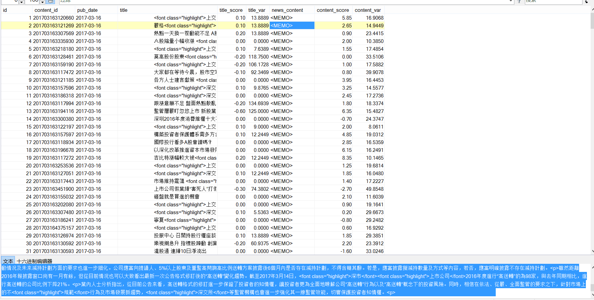

[toc]

> 这篇主要记录一下如何实现对数据库的并行运算来节省代码运行时间。语言是Python，其他语言思路一样。

***

### 前言

一共23w条数据，是之前通过自然语言分析处理过的数据，附一张截图：



要实现对news主体的读取，并且找到其中含有的股票名称，只要发现，就将这支股票和对应的日期、score写入数据库。

显然，几十万条数据要是一条条读写，然后在本机上操作，耗时太久，可行性极低。所以，如何有效并行的读取内容，并且进行操作，最后再写入数据库呢？

***

### 并行读取和写入
- 并行读取：创建N*max_process个进程，对数据库进行读取。读取的时候应该注意：
    1. 每个进程需要分配不同的connection和对应的cursor，否则数据库会报错。
    2. 数据库必须能承受相应的高并发访问（可以手动更改）

实现的时候，如果不在进程里面创建新的connection，就会发生冲突，每个进程拿到权限后，会被下个进程释放，所以汇报出来**NoneType Error**的错误。

- 并行写入：在对数据库进行更改的时候，不可以多进程更改。所以，我们需要根据已有的表，创建max_process-1个同样结构的表用来写入。表的命名规则可以直接在原来基础上加上1,2,3...数字可以通过对max_process取余得到。

此时，对应进程里面先后出现读入的conn（保存消息后关闭）和写入的conn。每个进程对应的表的index就是 主循环中的num对max_process取余(100->4,101->5)，这样每个进程只对一个表进行操作了。

***

### 部分代码实现
```python
max_process = 16 #最大进程数

def read_SQL_write(r_host,r_port,r_user,r_passwd,r_db,r_charset,w_host,w_port,w_user,w_passwd,w_db,w_charset,cmd,index=None):
    #得到tem字典保存着信息
    try:
        conn = pymysql.Connect(host=r_host, port=r_port, user=r_user, passwd =r_passwd, db =r_db, charset =r_charset)
        cursor = conn.cursor()
        cursor.execute(cmd)
    except Exception as e:
        error = "[-][-]%d fail to connect SQL for reading" % index
        log_error('error.log',error)
        return 
    else:
        tem = cursor.fetchone()
        print('[+][+]%d succeed to connect SQL for reading' % index)
    finally:
        cursor.close()
        conn.close()
    
    try:
        conn = pymysql.Connect(host=w_host, port=w_port, user=w_user, passwd =w_passwd, db =w_db, charset =w_charset)
        cursor = conn.cursor()
        cursor.execute(cmd)
    except Exception as e:
        error = "[-][-]%d fail to connect SQL for writing" % index
        log_error('error.log',error)
        return 
    else:
        print('[+][+]%d succeed to connect SQL for writing' % index)
    
    
    r_dict = dict()
    r_dict['id'] = tem[0]
    r_dict['content_id'] = tem[1]
    r_dict['pub_date'] = tem[2]
    r_dict['title'] = cht_to_chs(tem[3])
    r_dict['title_score'] =tem[4]

    r_dict['news_content'] = cht_to_chs(tem[5])
    r_dict['content_score'] = tem[6]
    
    for key in stock_dict.keys():
        #能找到对应的股票
        if stock_dict[key][1] and ( r_dict['title'].find(stock_dict[key][1])!=-1 or r_dict['news_content'].find(stock_dict[key][1])!=-1 ):
            w_dict=dict()
            w_dict['code'] = key
            w_dict['english_name'] = stock_dict[key][0]
            w_dict['cn_name'] = stock_dict[key][1]
            #得到分数
            if r_dict['title_score']:
                w_dict['score']=r_dict['title_score']
            else:
                w_dict['score']=r_dict['content_score']
            
            #开始写入
            try:
                global max_process
                cmd = "INSERT INTO dyx_stock_score%d VALUES ('%s', '%s' , %d , '%s' , '%s' , %.2f );" % \
                    (index%max_process ,r_dict['content_id'] ,r_dict['pub_date'] ,w_dict['code'] ,w_dict['english_name'] ,w_dict['cn_name'] ,w_dict['score'])
                cursor.execute(cmd)
                conn.commit()
            except Exception as e:
                error = "   [-]%d fail to write to SQL" % index
                cursor.rollback()
                log_error('error.log',error)
            else:
                print("   [+]%d succeed to write to SQL" % index)

    cursor.close()
    conn.close()
def main():
    num = 238143#数据库查询拿到的总数
    p = None
    for index in range(1,num+1):
        if index%max_process==1:
            if p:
                p.close()
                p.join()
            p = multiprocessing.Pool(max_process)
        r_cmd = ('select id,content_id,pub_date,title,title_score,news_content,content_score from dyx_emotion_analysis where id = %d;' % (index))
        p.apply_async(func = read_SQL_write,args=(r_host,r_port,r_user,r_passwd,r_db,r_charset,w_host,w_port,w_user,w_passwd,w_db,w_charset,r_cmd,index,))

    if p:
        p.close()
        p.join()
```