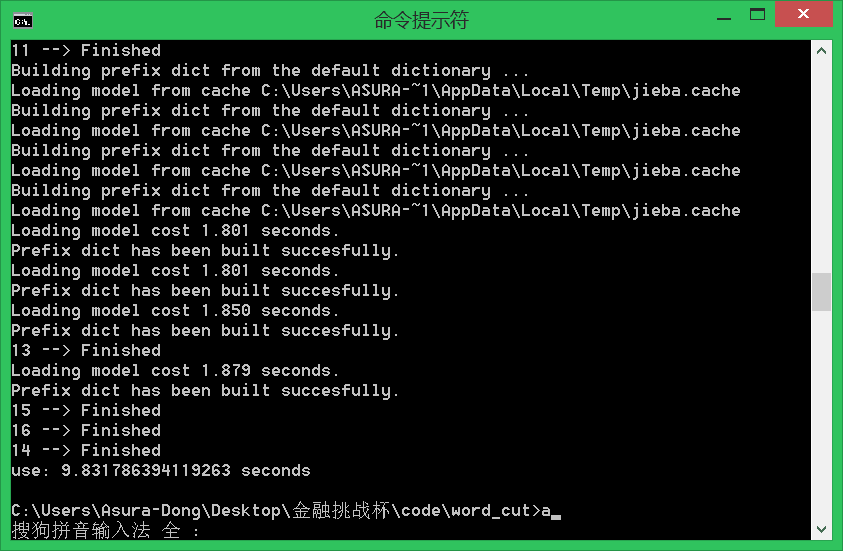
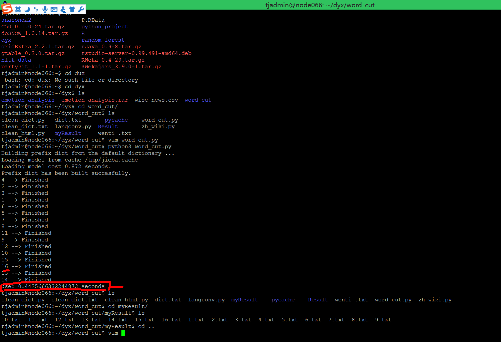
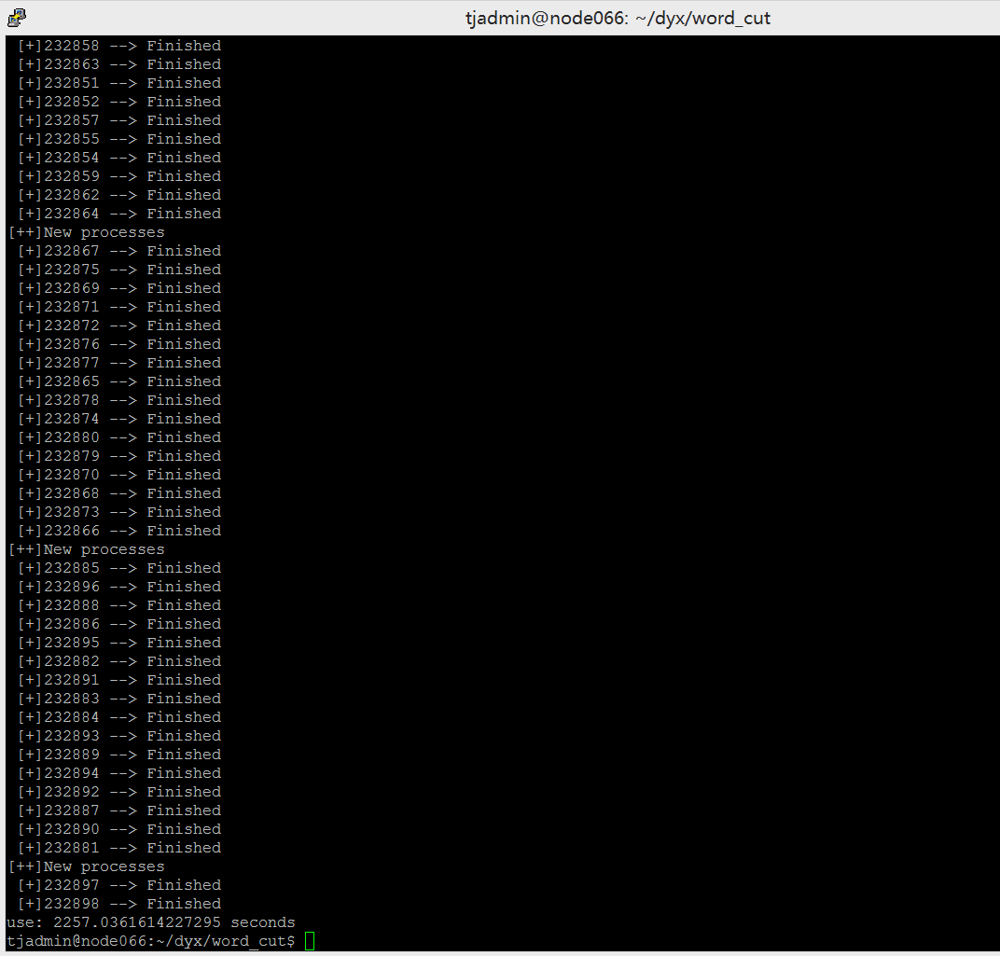

[toc]

> 这一个星期的工作主要分两部分，分别是

- **[分词](#dict)**
- **[html文本去标签代码的编写和优化](#clean_html)**
- **[研究python中的多进程和多线程，并将其运用到分词中来](#word_cut)**


***
<a id="dict"></a>
## 分词
> 去重和检查之后，拿到了218个词

### Idea
- 可以先写一段脚本，提取数据库里面所有'《》'中间的东西
- 有些词语不明所以
    - /同/系/将军/澳/南海/天晋/ 1063 不知道怎么分

***
<a id="clean_html"></a>
## html文本去标签代码的编写和优化

### 之前代码的遗留问题
- **全角**数字分词错误
    - ２４２２１ 被处理成了 ２/４/２/２/１（注意这是全角数字）
- 空格和特殊字符没替换

### html代码展示

> 包括了脚本、全角数字、网页字符等内容

```html
<div id="sidebar">
    <div id="tools">
    <h5 id="tools_example"><a href="/example/xmle_examples.asp">&nbsp;XML 实例,特殊字符：１５（处理之后应该没有了）</a></h5>
    <h5 id="tools_quiz"><a href="/xml/xml_quiz.asp">&#60;XML 测验&gt;</a></h5>
    <h3>&#39;ｖｅｖｅｖ&#39;</h3>
    </div>

    <div id="ad">
    <script type="text/javascript"><!--
    google_ad_client = "ca-pub-3381531532877742";
    /* sidebar-160x600 */
    google_ad_slot = "3772569310";
    google_ad_width = 160;
    google_ad_height = 600;
    //-->
    </script>
    <script type="text/javascript"
    src="http://pagead2.googlesyndication.com/pagead/show_ads.js">
    </script>
    </div>

    </div>
```

> 针对全角字符
```python
def Q2B(_char):#全角转半角
    if 65281<=ord(_char)<=65374:
        _char = chr(ord(_char)-65248)
    elif ord(_char)==12288:
        _char = chr(32)
    return _char

def B2Q(_char):
    if 33<=ord(_char)<=126:
        _char = chr(ord(_char)+65248)
    elif ord(_char)==32:
        _char = 
```
> 针对网页字符(由于时间原因，只写了录入了常用的一些，全部的字符之后可以在 [这里](http://www.runoob.com/tags/ref-entities.html) 爬下来)

```python
html_char = {}
html_char['&quot;'] = html_char['&#34;']='"'
html_char['&apos;'] = html_char['&#39;'] = "'"
html_char['&amp;'] = html_char['&#38;'] = '&'
html_char['&lt;'] = html_char['&#60;'] = '<'
html_char['&gt;'] = html_char['&#62;'] = '>'
html_char['&nbsp;'] = html_char['&#160;']= ' '
```

> 结果展示(图中的标签<>是网页字符实体转换过来的)




***
<a id="word_cut"></a>
## 研究python中的多进程和多线程，并将其运用到分词中来

### 遗留问题
- 脚本速度太慢
    - 500个文件处理下来就需要几分钟（取1分钟），那么23w+的数据需要约7个小时

### 多线程和多进程的区别

> 自己写的关于他们的区别  **[<--戳进去-->](http://www.cnblogs.com/AsuraDong/p/threading_process.html)**

### 代码实现

- 因为CPU密集型，所以采用多进程进行实现
- 为了充分利用多核的能力，并且处理非内核整数倍的情况，特做了以下实现

    ```python
    p = None
        index = 0
        for line in reader:# 不是'id'，是'\ufeff"id"'
            ID = str(line['\ufeff"id"'])
            line = line['news_content']
            if not (index%max_process):
                if p:#当有p的时候，说明之前进程池需要做完
                    p.close()
                    p.join()
                    print('[++]New processes')
                    p = multiprocessing.Pool(max_process)
                    p.apply_async(func = save_to_file,args=(line,ID,))
                else:#针对初始化时候没有Pool的情况
                    print('[++]New processed')
                    p = multiprocessing.Pool(max_process)
                    p.apply_async(func = save_to_file,args=(line,ID,))
            else: 
                p.apply_async(func = save_to_file,args=(line,ID,))
            index+=1
        if p:
            p.close()
            p.join()
    ```

- 这段代码稍作修改即可以应用在其他地方

### 效率展示

1. 先看一下自己的电脑 **跑4核多进程，处理16个进程** 的效果

(速度有了明显的提升)

2. 服务器上面 **跑16核多进程，处理16个进程** 的效果


3. 23w+数据结果


4. 分词结果（进入服务器IP查看）