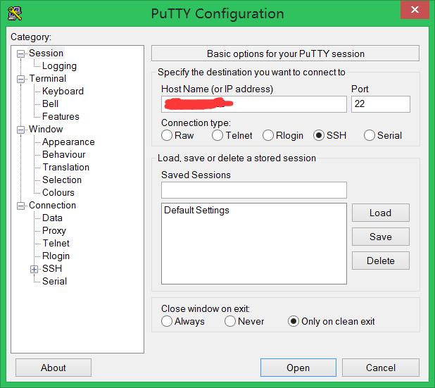
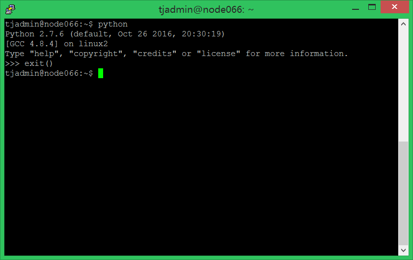
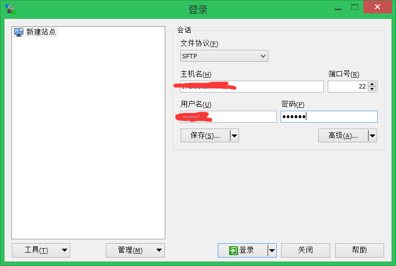

记录一下[WinSCP](http://baike.baidu.com/link?url=tZp1xxb3pW3-dFdDHMjzAyek7FhFzlgMnu1TPnbrlTemp9yKCbxL4FBOv-NjdNzKwPg3NiHLss_-MKsNrlwwTK)和[putty](http://baike.baidu.com/link?url=0Rx66v_CktZlG5WaRpaAneO_TSXj6AFMEBaSeJz8I17M-pc2Dg3wA7Fqkn-CoLxOsoT5Gtxef6Bv0gVMdZmGra)的用法。

**putty：远程cmd窗口，在本机通过命令行操作服务器，并且拿到运行结果。而本机只有连接作用，大大减小了负担。**

登陆界面输入ip地址，没有特殊情况，默认选项就可以了。截图

输入用户名和密码，进行登陆。截图

然后就可以在服务器上跑程序了。截图

**WinSCP：极为方便地管理远程服务器的文件夹。然后再用上面的putty就可以运行程序了。**

登陆界面输入ip，账号，密码

进入后，左边是本机的文件夹，右边是服务器的文件夹。可以方便的进行文件转移。然后再打开putty运行程序。

***

> 欢迎进一步交流本博文相关内容： 
博客园地址 : <http://www.cnblogs.com/AsuraDong/> 
CSDN地址 : <http://blog.csdn.net/asuradong> 
也可以致信进行交流 : <xiaochiyijiu@163.com>  
**欢迎转载** , 但*请指明出处 &nbsp;:&nbsp;&nbsp;)*

***