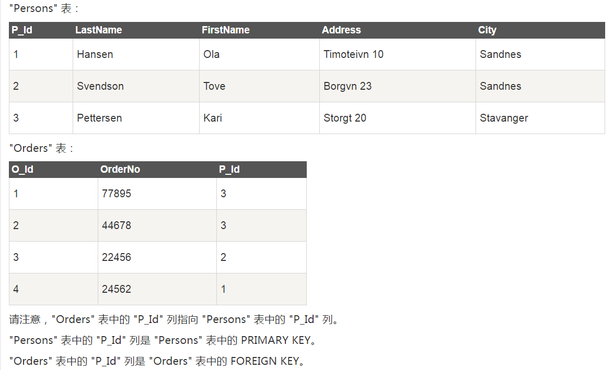

[TOC]

>  **约束：简单的说，就是创建表的时候，对表或者其中的列的属性的初始化或修改或删除。**

## NOT NULL约束
强制列不接受`NULL`值

```sql
CREATE TABLE forLearn
( ID int NOT NULL,City varchar(255));
```

## INDEX 索引
特点：
1. 在不读取整个表的情况下，索引使数据库应用程序可以更快地查找数据。
2. 但是更新表会更新索引，所以Time更久。
3. 一般仅在需要查找的列上做索引。

语句：
```sql
CREATE INDEX index_name ON forLearn (myID,city);#创建索引
DROP INDEX index_name ON forLearn; #删除索引
```

## CHECK 约束

特点：
1. 如果对单个列定义 CHECK 约束，那么该列只允许特定的值。
2. 如果对一个表定义 CHECK 约束，那么此约束会基于行中其他列的值在特定的列中对值进行限制。

**创建时添加**
```sql
CREATE TABLE ForLearn
(
_ID int NOT NULL,
City varchar(255),
CHECK (_ID>0) #_ID 必须为正值
);
```

```sql
CREATE TABLE ForLearn2
(
_ID int NOT NULL,
City varchar(255),
CONSTRAINT chk_learn CHECK (_ID>0 and City='BeiJing') #创建多列CHECK约束
);
```

**创建后添加**

```sql
use dyx;


CREATE TABLE ForLearn4
(
_ID int NOT NULL,
City varchar(255),
_Name varchar(255) NOT NULL
);

ALTER TABLE ForLearn4
ADD CHECK (_ID>0); #添加单列约束

ALTER TABLE ForLearn4
ADD CONSTRAINT City_Name CHECK (City='ShenZhen' and _Name='AsuraDong'); #添加多列约束
```

**撤销约束**
```sql
ALTER TABLE ForLearn4
DROP CHECK City_Name;
```

## DEFAULT 约束
用于向列中插入默认值。如果没有规定其他的值，那么会将默认值添加到所有的新记录。

**创建时添加**
```sql
CREATE TABLE forLearn
(
myID int not null,
city varchar(255) DEFAULT 'ShenZhen' #默认值设置为 ShenZhen 
);
```

**创建后添加**
```sql
ALTER TABLE forLearn
ALTER myID SET DEFAULT 1;
```

**撤销**
```sql
ALTER TABLE forLearn
ALTER myID DROP DEFAULT;
```


## UNIQUE 约束

特点：
1. UNIQUE 约束唯一标识数据库表中的每条记录
2. 每个表可以有多个 UNIQUE 约束
3. UNIQUE 约束的列不能有重复值


**创建的时候添加约束（单列）：**
```sql
CREATE TABLE forLearn
( ID int NOT NULL, City varchar(255),UNIQUE (ID));
```

**创建时候添加约束集合（多列）：**
```sql
CREATE TABLE forLearn
(
City_id int NOT NULL,
City_index int NOT NULL,
City_name varchar(255),
CONSTRAINT ID_INDEX UNIQUE (City_id,City_index)
);
```

> 注意这里有坑：命名的时候像`index`，`id`这种可能是BIF或关键词的，一定要加`_`来区分一下。而数据库又是**大小写不敏感**，所以下面这句话就会报语法错误(找了很久，记录一下)
    ```sql
    CREATE TABLE forLearn
    (
    City_id int NOT NULL,
    Index int NOT NULL,
    City_name varchar(255),
    CONSTRAINT ID_INDEX UNIQUE (City_id,Index)
    );
    ```

**创建后添加约束（单列）**
```sql
ALTER TABLE forLearn
ADD UNIQUE (City_id);#有括号
```

**创建后添加约束集合（多列）**
```sql
ALTER TABLE forLearn
ADD CONSTRAINT IndexOfName UNIQUE (City_index,City_name);
```

**撤销UNIQUE约束（单列）：**
```sql
ALTER TABLE forLearn
DROP INDEX City_id; #无括号
```

**撤销UNIQUE约束集合（多列）：**
```sql
ALTER TABLE forLearn
DROP INDEX IndexOfName; 
```

## PRIMARY KEY 约束

特点：
1. 束唯一标识数据库表中的每条记录（和`UNIQUE`一样）
2. 对应列的值不能重复
3. 对应列不能包含 NULL 值
4. 只能有一个`PRIMARY KEY`约束（和`UNIQUE` 不一样）
5. 使用方法基本同`UNIQUE`。*撤销有不同*

**创建添加约束（单列）**
```sql
CREATE TABLE Persons
(
P_Id int NOT NULL,
LastName varchar(255) NOT NULL,
FirstName varchar(255),
Address varchar(255),
City varchar(255),
PRIMARY KEY (P_Id)
);
```

**创建添加约束集合（多列）**
```sql
CREATE TABLE Persons
(
P_Id int NOT NULL,
LastName varchar(255) NOT NULL,
FirstName varchar(255),
Address varchar(255),
City varchar(255),
CONSTRAINT pk_PersonID PRIMARY KEY (P_Id,LastName)
);
```

**创建后添加约束（单列）**
```sql
ALTER TABLE Persons
ADD PRIMARY KEY (P_Id);
```

**创建后添加约束集合（多列）**
```sql
ALTER TABLE Persons
ADD CONSTRAINT pk_PersonID PRIMARY KEY (P_Id,LastName);
```

**撤销primary约束**
```sql
ALTER TABLE Persons
DROP PRIMARY KEY; #因为每个表只有一个primary key。所以直接drop即可
```

## FOREIGN KEY
一个表中的 FOREIGN KEY 指向另一个表中的 PRIMARY KEY。

两个示例表如下所示：（截图）



**创建时添加约束**
```sql
CREATE TABLE Orders
(
O_Id int NOT NULL,
OrderNo int NOT NULL,
P_Id int,
PRIMARY KEY (O_Id), 
FOREIGN KEY (P_Id) REFERENCES Persons(P_Id) #声明foreign key
);
```

**创建后**
```sql
ALTER TABLE Orders
ADD CONSTRAINT fk_PerOrders #给一个名字，便于删除
FOREIGN KEY (P_Id)
REFERENCES Persons(P_Id);
```

**撤销约束**
```sql
ALTER TABLE Orders
DROP FOREIGN KEY fk_PerOrders;
```


***

> 欢迎进一步交流本博文相关内容：<br>
博客园地址 : <http://www.cnblogs.com/AsuraDong/><br>
CSDN地址 : <http://blog.csdn.net/asuradong><br>
也可以致信进行交流 : <xiaochiyijiu@163.com> <br>
**欢迎转载** , 但*请指明出处 &nbsp;:&nbsp;&nbsp;)*

***