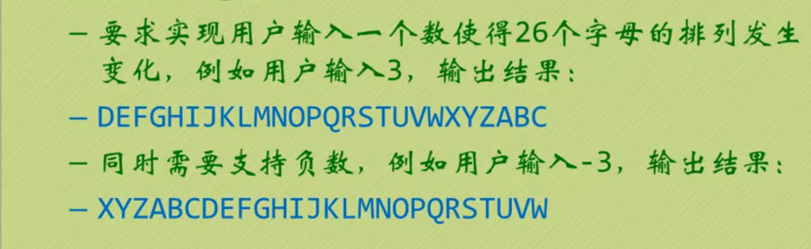

[toc]

## 双向链表和双向循环链表

**和单向链表相比，多了一个前驱结点。如果他为空，那么next和prior都指向自己。而对于双循环链表，只需要最后一个元素的next指向head->next，head->next的prior指向最后一个节点即可。**

## 插入操作
> 新节点s插入链表，s->next给p结点，s->prior给p->prior，然后，p->prior->next指向s，p->prior再指向s。顺序需要注意

```c++
s->next = p;
s->prior = p->prior;
p->prior->next = s;
p->prior = s;
```

## 删除操作
> 删除结点p。p->next->prior 指向 p->prior，p->prior->next 指向 p->next 。最后将p结点delete。

```c++
p->prior->next = p->next;
p->next->prior = p->prior;
delete p;
```

***

## 实例操作

（附截图）



**注意：因为函数没有返回`Node*`类型，所以这里对指针进行引用，否则在退出函数的时候，并没有保存改变。如果需要删除全部链表，需要保存InitList之后的head地址，否则会遗漏一个Node结点没有删除。**

代码实现：
```c++
#include<iostream>
#include<cstddef>
#include<cstdio>
using namespace  std;

const int OK = 1;
const int ERROR = 0;
const int LETTERNUM = 26;
typedef char ElemType;

struct Node{
	ElemType data;
	Node * prior;//前驱结点
	Node * next;//后驱结点 
};

int InitList(Node *&L){
	Node *p,*q;
	int i;
	
	L = new Node; //头结点 
	L->next = L->prior = NULL;
	p = L; //p是当前指针
	 
	for(int i=0;i<LETTERNUM;i++){
		q = new Node; //q是临时指针 
		q->data = 'A' + i;
		q->prior = p;
		q->next = p->next;
		p->next = q;
		p = q;//指针移动 
	}
	p->next = L->next; //尾结点指向head->next(第一个有字母的地址) 
	L->next->prior = p;
	
	return OK;
}

void Change(Node *&L,int i){ //移动头指针 
	if (i>0){
		while(i--){
			L = L->next;
		}
	}
	else if (i<0){
		L = L->next ; 
		while(i++){
			L = L->prior;
		}
	}
	else{
		L = L->next;
	}
}


int main(){
	Node *head = NULL;
	int i,n;
	InitList(head);
	//Node *s_head = head; // 保存头结点之后删除 
	cout<<"输入位置："<<endl;
	cin>>n;
	Change(head,n);
	
	for(i = 0;i<LETTERNUM;++i){
		head = head->next;
		cout<<head->data<<" "; 
	}
	
	cout<<endl;
	return 0;
} 

```

***

> 欢迎进一步交流本博文相关内容：<br>
博客园地址 : <http://www.cnblogs.com/AsuraDong/><br>
CSDN地址 : <http://blog.csdn.net/asuradong><br>
也可以致信进行交流 : <xiaochiyijiu@163.com> <br>
**欢迎转载** , 但*请指明出处 &nbsp;:&nbsp;&nbsp;)*

***