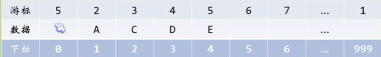
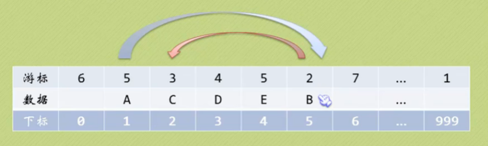
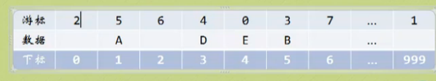

[toc]

> 早期语言没有c，更不用说java等一些高级语言。那么是怎么描述链表这种实现呢？这次以单链表的模拟为例，深究一下 **静态链表** 的实现。

### 静态链表结构

> 按照之前单链表的性质，我们需要**游标和数据**。当然，每个元素都有下标（类似数组）

#### 游标的含义
静态链表中，首节点和尾结点都没有数据（**数据为空**）<br>
**首节点的游标**指向第一个含有数据为空的元素的下标。<br>
**最后一个节点的游标**指向第一个含有数据（不为空）的元素的下标。<br>
附一张截图




#### 代码实现

```c++
#include<iostream>
#include<string>
using namespace std;

const int MAXSIZE = 1000;
typedef int ElemType;
typedef struct{
	ElemType data;//数据 
	int cur;	 //游标 
} Component ,StaticList[MAXSIZE];
```

### 静态链表初始化
> 未使用的数组元素是备用链表，这里我们做最简单的初始化

```c++
string InitList(StaticList L){
	for(int i=0;i<MAXSIZE-1;i++)
		L[i].cur = i+1;
	L[MAXSIZE-1].cur = 0; 
	return "Create an initlist";
}
```
### 得到长度(类似单链表)
> 比较简单，直接代码实现吧
```c++
// 返回L中元素的个数
int GetLength(StaticList L){
	int num=0;
	int i = L[MAXSIZE-1].cur;
	while(i){
		i = L[i].cur;
		num++;
	}
	return num;
} 
```
### 插入操作的实现
> 怎么模拟`new`和`delete` 的操作？即：需要的时候申请，不需要的时候释放它呢？做到模拟链表内存操作。<br>这时候，**将所有未被使用和删除的用游标连接成一个备用链表**<br>
再插入的时候，取得备用链表第一个结点做为插入结点即可。

附截图



注意：我们访问是按照游标读取的，所以 读取顺序: **下标:数据(游标) 1:A(5)-->5:B(2)-->2:C(3)-->3:D(4)......**

#### 代码实现
 先实现获得空闲分量下标的函数
```c++
//获得空闲分量下标 
int GetEmpty(StaticList L){
	int i = L[0].cur;//获得第一个空闲游标对应下标
	if ( L[0].cur)
		L[0].cur = L[i].cur;//将下标为i的元素的下一个分量作为备用链表首节点
	return i ; 
} 
```
然后是插入代码
```c++
//实现第i个元素前面插入新的元素 
string InsertList(StaticList L,int i,ElemType e) {
	int j,k,l;
	k = MAXSIZE - 1;
	if (i<1||i>GetLength(L))
		return "Insert fail: index out of range";
	j = GetEmpty(L);//空闲分量下标
	if(j){
		L[j].data = e;
		for(l = 1;l<=i-1;l++)
			k = L[k].cur;
		L[j].cur = L[k].cur;//取出来L[k].cur，存放在插入结点中 
		L[k].cur = j;//再将L[k].cur的下标变成 插入节点的index值 
		return "Inserted";
	} 
	return "Insert fail";
}
```

### 删除操作
> 假设我们删除index = 2 的元素,那么肯定要改变备用链表和index = 5 的元素的cur（让其cur变为3）。而index = 0 的首节点的cur也要从6变为 2，index = 2的cur也得改变。即：**交换两者的cur**（附截图）



```c++
//将下标为k的空闲结点回收到备用链表
void DeleteNode(StaticList L,int k){
	L[k].cur = L[0].cur;
	L[0].cur = k;
} 
//删除对应Node 
string DeleteList(StaticList L,int i){
	int j,k;
	if(i<1 || i>GetLength(L))
		return "Delete fail: index out of range";
	k = MAXSIZE - 1;
	for(j=1;j<=i-1;j++)
		k = L[k].cur;
	j = L[k].cur;//要删除元素的下标
	L[k].cur = L[j].cur;//将链表重新连接
	DeleteNode(L,j);
	return "Deleted";
}
```

## 总结
> 这种链表主要针对不提供指针操作的变成语言实现的。但是也不能像指针那样灵活利用内存。但是空的数据，我们可以理解为垃圾内存（被释放掉了的）。最重要的是理解这种思想（水一波）。