[toc]


## 树
> 不同于队列、栈等一对一的数据结构，**树是一对多的数据结构**。树（Tree）是n（n>=0）各节点的有限集。当n=0，为空树。

**在任意一颗非空树中：**

1. 有且只有一个特定的结点称为：根(Root)
2. 当n>1时，其余结点可分为m(m>0)个互不相交的有限集T1、T2、...Tm。其中每一个树本身又是一棵树，并且称为：子树。

**两点注意：**

1. n>0时候，根节点唯一。
2. m>0时候，子树个数虽然没有限制。但是他们不会相交（不会形成类似环状的形状）

### 树的结点
**结点：**

> 度：结点拥有的子树个数称之为结点的度。整棵树的度：各结点度的值的最大值。

1. 度为0的结点称为：叶节点或者终端结点
2. 度不为0的结点称为：分支结点
3. 度不为0且不是根节点的结点称为：内部结点。
（附截图）
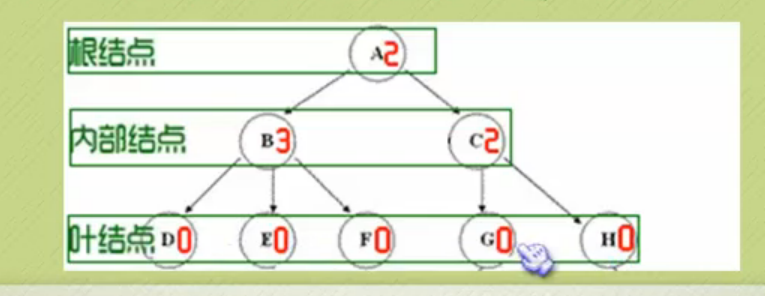

**结点关系**

1.  Child：结点子树的根；Parent：相应的，该结点就是Parent
2. Sibling（兄弟）：统一Parent的Child之间的关系
3. 祖先结点：从根到该结点所经过的分支上的所有结点。

**深度或高度：**
树中结点的最大层次称为输的深度或高度。下面截图就是高度和度均为3的一棵树：
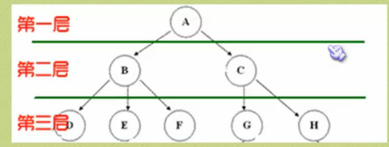

### 其它定义
**有序树和无序树：**
如果将树中结点的各子树看成从左到右有次序的，不能互换的，就是有序树；否则就是无序树。

**森林：**
是m>0棵互不相交的树的结合。对树中每个结点，其子树的集合就是森立。

---

## 二叉树

特点：

1. 二叉树的度<=2。
2. 二叉树是有序树。

### 五种基本形态
截图
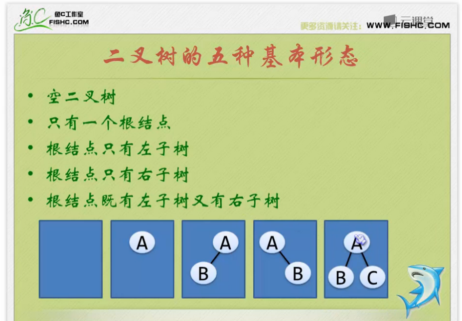

### 特殊二叉树

- **斜二叉树**

1. 左斜树：所有结点都只有左子树的二叉树；
2. 右斜树：所有结点都只有右子树的二叉树；截图

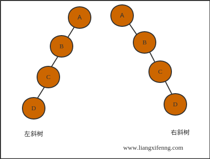

- **满二叉树**
1. 所有分支结点的度为２；
2. 所有叶子结点只能分布在最下层上；
3. 同样深度的二叉树中，满二叉树的结点数最多，叶子结点数最多；

- **完全二叉树**
1. 所有叶子结点只能出现在最下两层
2. 若结点度为1，则该结点只有左子树，不存在只有右子树的情况
3. 结点分配 先左后右

通过截图1和截图2看一下满二叉树和完全二叉树的区别：
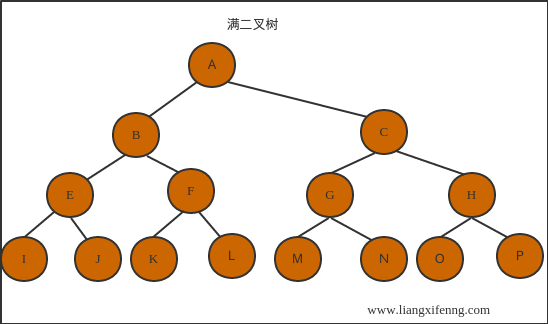

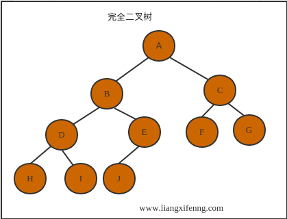

***

> 欢迎进一步交流本博文相关内容：<br>
博客园地址 : <http://www.cnblogs.com/AsuraDong/><br>
CSDN地址 : <http://blog.csdn.net/asuradong><br>
也可以致信进行交流 : <xiaochiyijiu@163.com> <br>
**欢迎转载** , 但*请指明出处 &nbsp;:&nbsp;&nbsp;)*

***


### 数学性质

- 二叉树的第i层上最多有2^(i-1)个结点(i>=1)
- 深度为k的二叉树最多有2^k-1 个结点
- 如果中断节点数为n0，度为2的节点数为n2，那么n0 = n2+1 ...(1)

	推导：
	设度为1的节点数为n1。那么 总结点数 n= n0+n1+n2
	
	连接数（连接线）为n-1。通过图易得 也等于 n1+2*n2。
	
	所以n-1 = n1+2*n2.......(2)
	
	联立等式(1).(2)可得到性质三。

- 具有n个结点的完全二叉树的深度为[log_2 n]+1

	推导：
	深度为k的满二叉树结点为n = 2^k-1 。所以k = log_2(n+1)。
	
	而完全二叉树叶子结点在最下面两层。所以，倒数第二层以上的满二叉树 n = 2^(k-1)-1 。 
	
	So : 2^(k-1)<= n <= 2^k-1
	
	So: 2^(k-1)<= n < 2^k
	
	So: k-1<= log_2 n <k
	
	所以：k = [log_2 n ]+1

- （见截图）。效果见截图。注意结点的排序，从上到下，从左到右。

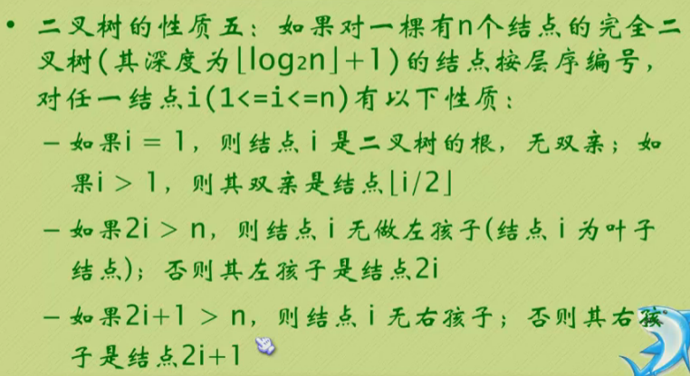

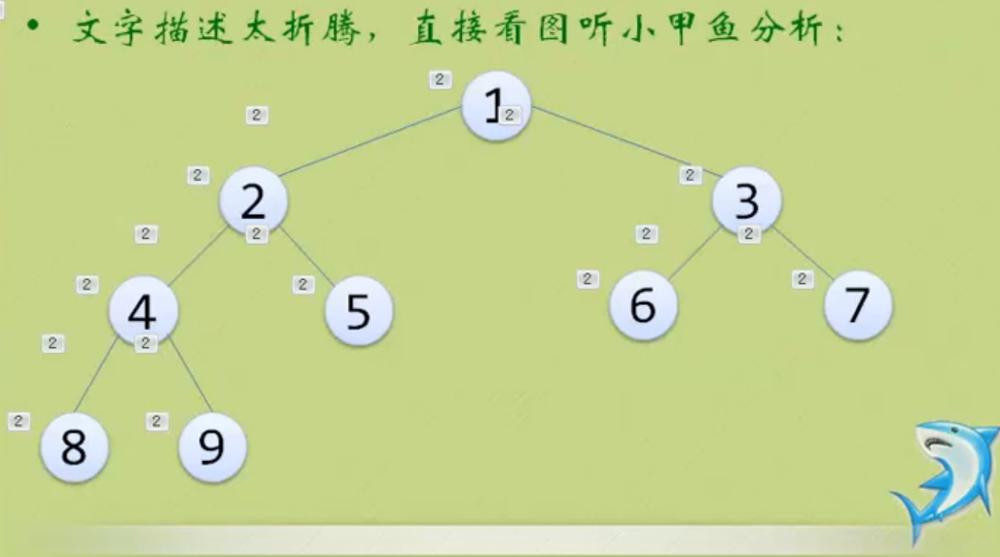
---

## 二叉树建立和遍历代码实现

### 二叉树的存储结构

- 顺序存储，方便查询操作，并且可以根据层序遍历，合理的利用以上特性（截图)
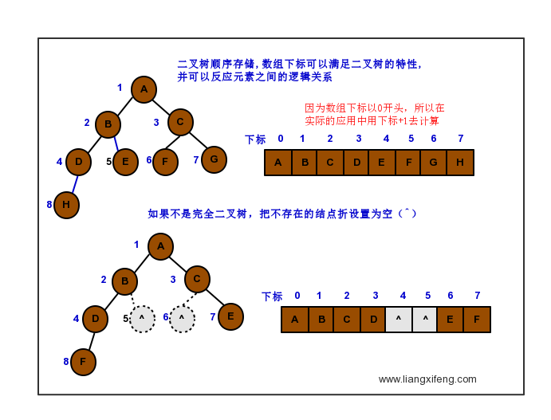

- 链式存储，方便新增，删除操作；结构为数据域+左孩子指针+右孩子指针 （二叉链表），如果有必要的情况下可以添加双亲指针，指向结点的双亲（三叉链表），这都是根据业务需求 灵活控制 的。（截图）

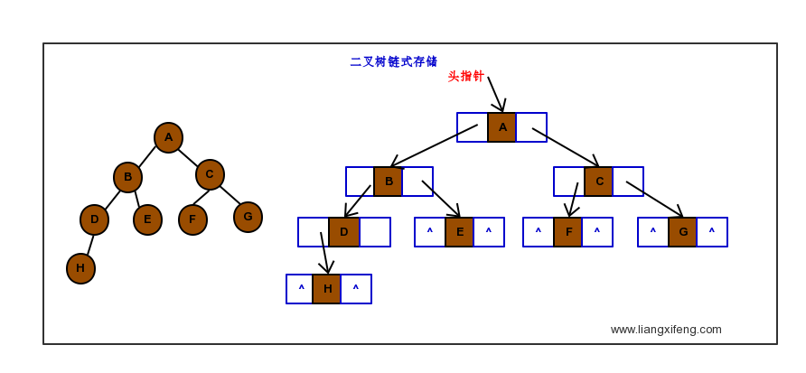

### 二叉树的遍历方式

> 有三种遍历方式。命名的根据是按照根节点被遍历的顺序。前序、中序 || 后序、中序 可以确定一个二叉树。但是前序+后序不可以确定一颗二叉树。

1. 前序：先访问根结点 -> 遍历左子树 -> 遍历右子树；先访问根结点
2. 中序：遍历左子树 -> 访问根结点 -> 遍历右子树；中间访问根结点
3. 后序：遍历左子树 -> 遍历右子树 -> 后访问根结点；后访问根结点
4. 层序：自上而下，从左到右逐层访问结点；

下面截图展现了4中遍历方式。
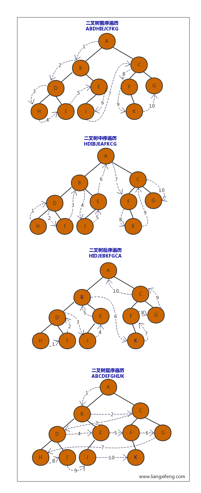

## 代码实现

```c++
#include<iostream>
#include<cstdio>
using namespace std;

typedef char ElemType;
struct BinTree{
	ElemType data;
	BinTree *lchild,*rchild;//左子树和右子树 
}; 

//按照前序遍历创建二叉树。注意输入的顺序也必须得是前序遍历的顺序。 
void CreateBinTree(BinTree *&T){
	ElemType c;
	scanf("%c",&c);
	if(c!=' '){
		T = new BinTree;
		T->data = c;
		CreateBinTree(T->lchild);//递归创建 
		CreateBinTree(T->rchild);
	}
	else
		T = NULL;//空格代表是空子树 
}

//递归查找二叉树的深度 
int BinTreeDepth(BinTree *T){
	int left_depth,right_depth;
	if(T==NULL) return 0;
	else{
		left_depth = BinTreeDepth(T->lchild)+1;
		right_depth = BinTreeDepth(T->rchild)+1;
		return left_depth>=right_depth?left_depth:right_depth; //返回最大深度 
	}
} 
//按照前序遍历二叉树
//中序和后序只需要改变if(T)条件中语句顺序 
void PreOrderBinTree(BinTree *T,int level){
	if(T){
		cout<<"在第"<<level<<"层，"<<"数据是："<<T->data<<endl;
		PreOrderBinTree(T->lchild,level+1);//遍历左子树 
		PreOrderBinTree(T->rchild,level+1);//遍历右子树 
	}
}

//清空二叉树。注意if中自调用和delete语句的顺序 
void ClearBinTree(BinTree *&T){
	if(T){
		ClearBinTree(T->lchild);
		ClearBinTree(T->rchild);
		delete T;
	}
}

//查找含有对应数据的结点。返回值是结点的指针

BinTree* FindNode(BinTree *T ,ElemType data){
	if(T==NULL)
		return NULL;
	else
		if(T->data == data)
			return T;
		else{
			BinTree *tem=NULL;
			if(tem=FindNode(T->lchild,data))
				return tem;
			else if(tem=FindNode(T->rchild,data))
				return tem;
			else 
				return tem;
		}
} 
//输入为（注意空格）:AB D  CE   
int main(){
	int level = 1;
	BinTree *T = NULL;
	CreateBinTree(T) ;
	PreOrderBinTree(T,level);
	cout<<"二叉树的深度是："<<BinTreeDepth(T)<<endl; 
	
	BinTree *NodeD = FindNode(T,'D');
	cout<<NodeD->data<<endl;
	return 0;
}
```


1. [参考博客](http://www.jianshu.com/p/43b6b90555ca)
2. [参考视频](http://study.163.com/course/courseLearn.htm?courseId=468002#/learn/video?lessonId=1060074&courseId=468002)