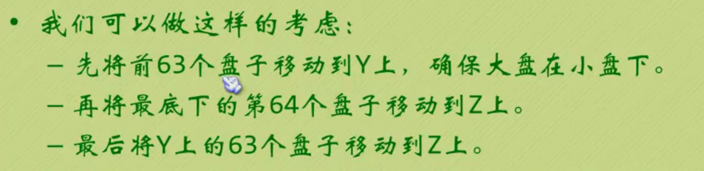
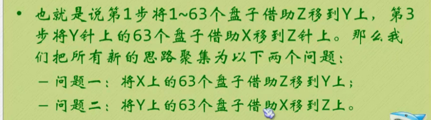

[TOC]

## 递归和分治思想
> 如果可以使用迭代，尽量别使用递归。由编译原理可以知道，每次自调用的时候，计算机都需要保存在调用，浪费时间空间。当然，迭代是当我们知道循环次数的时候。而**当我们不知道循环次数，比如说对于文件夹和文件进行遍历，不知道深度的情况下，我们就需要递归来实现。**<br>
显然，递归是先解决小的问题，这种思想是**分治思想**。根据具体需求，来决定是否使用递归。

**递归要注意：**
- 结构是选择结构，而迭代是循环结构
- 必须有基线条件和递归条件，防止出现死循环
- 如果知道循环次数的话，尽量使用递归
- 对于某些编程式函数，有对于尾递归的迭代优化
- *递归逻辑更容易理解*

## 一些实例
### 逆序输出字符串
```c++
#include<iostream>
using namespace std;

void print(){
	char a;
	cin>>a;
	if(a!='#') print(); // 不是停止符，先自调用 
	if(a!='#') cout<<a; //在回来的时候，打印自己的字符 
}
int main(){
	print();
	return 0;
}
```

### 查找数组元祖是否存在
> 很多时候我们需要查找一个数组中是否有一个元素。如果使用迭代，肯定十分简单，时间复杂度为O(n)。<br>
此时，如果使用分而治之的思想，我们可以使用二分法来进行查找。不论多大的数据，时间复杂度显著降低为O(log_2 n)。也就是说一个大小为123456789的数组，使用迭代，我们需要123456789个时间单位。但是二分法只需要27次。

实现思路：
1. **首先转化的思想对数组进行排序**。如果不排序，那么low和high就没有意义了。
2. 再用迭代进行二分

```c++
#include<iostream>
#include<algorithm>
using namespace std;
const int SIZE = 5;
const int NONE = -1;
//二分查找并且返回element的位置，没查找到则返回NONE
template<class T>
int BinFind(T *arr,int low,int high,T elem){  
	int mid;
	if(low>high)
		return NONE;
	else{
		mid = (low+high)/2;
		if(arr[mid] == elem)
			return mid;
		else if(elem>arr[mid])
			return BinFind(arr,mid+1,high,elem);
		else
			return BinFind(arr,low,mid-1,elem);
	}
}
int main(){
	int *arr = new int [SIZE];
	cout<<"请输入"<<SIZE<<"个数据："; 
	for(int i=0;i<SIZE;++i)
		cin>>arr[i];
	sort(arr,arr+SIZE);
	int elem;
	cout<<"输入您要查找的数据："<<endl;
	cin>>elem; 
	int index = BinFind(arr,0,SIZE-1,elem);
	if (index+1)
		cout<<"含有这个数据\n";
	else
		cout<<"不含有这个数据";
	return 0;
}
```

### 汉诺塔问题

首先我们假设需要移动64层，那么思路如下（附截图）：




此时，需要解决两个问题（附截图）：



一直这样类推，知道最后从begin(开始柱子)->end(目标柱子)。

**按照第一张截图，我们可以写出来函数里面else的递归部分。并且，每次输出的时候，就对应着思路里面的移动（而不是分治），此时step步数需要加+。**

```c++
#include<iostream>
#include<algorithm>
using namespace std;
void Hanoi(int num,char begin,char by,char end,int &step){
	if(num==1){
		cout<<begin<<"-->"<<end<<endl;
		++step;
	}
	else{
		Hanoi(num-1,begin,end,by,step);
		cout<<begin<<"-->"<<end<<endl;
		++step;
		Hanoi(num-1,by,begin,end,step);
	}
}
int main(){
	int step = 0;
	int num;
	cout<<"汉诺塔层数是: ";
	cin>>num;
	Hanoi(num,'X','Y','Z',step);
	cout<<"一共有："<<step<<"步数"<<endl; 
	return 0;
}
```

### 八皇后问题
> 在8×8格的国际象棋上摆放八个皇后，使其不能互相攻击，即任意两个皇后都不能处于同一行、同一列或同一斜线上，问有多少种摆法。正规的方法是递归，如果不考虑效率，这里采用递归实现。**假设从第一行开始，每一行都找到符合条件的一个位置，而条件就是新的一行的新位置符合要求，以此类推，就可以写出来递归函数。**

```c++
#include<iostream>
using namespace std;

const int Q_NUM = 8;
int queens[Q_NUM][Q_NUM] = {0};
int RESULT = 0;

void print(){
	for(int i=0;i<Q_NUM;++i){
		for (int j=0;j<Q_NUM;++j)
			cout<<queens[i][j]<<" ";
		cout<<endl;
	}
	cout<<endl<<endl;
}
bool IfQueen(int row,int col){
	if(row==0){
		//当第一行时候，随便摆放 
		queens[row][col] = 1;
		return true;
	}
	/**************其他时候，需要考虑上面的同一列、左上角斜线、右上角斜线，以下分别实现*****/ 
	for(int i=0;i<row;++i)
		if(queens[i][col]==1)
			return false;
	
	for (int i=row-1,j = col-1;i>=0 && j>=0;--i,--j)
		if(queens[i][j]==1)
			return false;
	
	for(int i=row-1,j=col+1;i>=0 && j<Q_NUM;--i,++j)
		if(queens[i][j]==1)
			return false;
	
	/******当所有情况都满足********/
	queens[row][col] = 1;
	return true;
}
void Queen(int row){
	if(row==Q_NUM){ //注意row是从0开始到Q_NUM-1结束。这样当row==Q_NUM时，已经排完所有情况 
		++RESULT;   //这样当row==Q_NUM时，已经排完所有情况，进行输出就可以了。 
		print();
		return ;
	} 
	for(int i=0;i<Q_NUM;++i){ //i代表列数 
		if(IfQueen(row,i)) //如果row行i列可以放得话，判断下一行 
			Queen(row+1);
		queens[row][i] = 0; //重置为0，防止下次结果干扰 
	}
}

int main(){
	Queen(0);
	cout<<"一共"<<RESULT<<"种摆法\n";
	return 0;
}
```

***

## 更多：
**毫无疑问，递归以及分治思想还有很多用法：斐波那契数列、快速排序、文件查找、字典树的建立等等。理论上递归可以解决任何问题，而作为我们只需要提供思路，其他的交给计算机解决。所以听人说过计算机最适合解决递归问题。但是，有利有弊，递归同样会消耗更多的内存。在初步实现阶段，将大问题分而治之，分装成递归函数，还是逻辑代码化的最佳表达。**

***

> 欢迎进一步交流本博文相关内容：<br>
博客园地址 : <http://www.cnblogs.com/AsuraDong/><br>
CSDN地址 : <http://blog.csdn.net/asuradong><br>
也可以致信进行交流 : <xiaochiyijiu@163.com> <br>
**欢迎转载** , 但*请指明出处 &nbsp;:&nbsp;&nbsp;)*

***