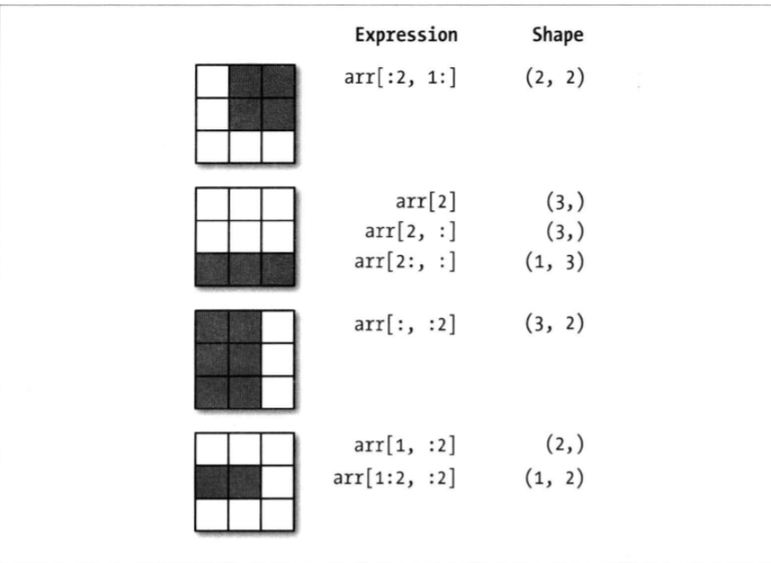

```python
import numpy as np
import pandas as pd
```

## 1.array数组

### 1.1创建array数组

- np.array
- np.zeros/empty/ones:传入形状即可
- np.arange():比range更强大
- np.diag():对角阵

**详细的见下面图片和例子**


```python
data1 = [6,7.5,8,0,1]
arr1 = np.array(data1)#创建array
print(arr1)

data2 = [data1,data1]
arr2 = np.array(data2) #多维度
print(arr2)
```

    [ 6.   7.5  8.   0.   1. ]
    [[ 6.   7.5  8.   0.   1. ]
     [ 6.   7.5  8.   0.   1. ]]
    


```python
print(arr1.shape,arr2.shape)
print(arr1.dtype,arr2.dtype)
```

    (5,) (2, 5)
    float64 float64
    


```python
print(np.zeros(10)) #创建都是0的array
print(np.empty([2,3,2],dtype=float)) #都是空的array
```

    [ 0.  0.  0.  0.  0.  0.  0.  0.  0.  0.]
    [[[ 0.  0.]
      [ 0.  0.]
      [ 0.  0.]]
    
     [[ 0.  0.]
      [ 0.  0.]
      [ 0.  0.]]]
    


```python
print(np.arange(15)) # 类似range函数，但更强大
```

    [ 0  1  2  3  4  5  6  7  8  9 10 11 12 13 14]
    


```python
print(np.diag((1,2,3)))# 创建对角阵
x = np.arange(10,19).reshape((3,3))
print(x)
print(np.diag(x)) #提取对角
print(np.diag(x,1)) #注意对角线的位置
```

    [[1 0 0]
     [0 2 0]
     [0 0 3]]
    [[10 11 12]
     [13 14 15]
     [16 17 18]]
    [10 14 18]
    [11 15]
    

### 1.2array数据类型

- 要使用astype来进行转化。转化的过程中产生一份拷贝。


```python
arr1 = np.array([1,2,3],dtype=np.float64) #初始化显式声明
print(arr1.dtype)
```

    float64
    


```python
int_arr1 = arr1.astype(np.int) # 类型转化
print(int_arr1.dtype)
#浮点型=>整型。向下取整

strintArr = np.array(['15','1.6'],dtype=np.string_)
print(strintArr)
print(strintArr.astype(np.float))
```

    int32
    [b'15' b'1.6']
    [ 15.    1.6]
    

### 1.3数组运算

**不用再写循环了，运算符号会被映射到每个element**

### 1.4切片和索引

**注意：如果需要一份拷贝（副本），而不是视图，需要调用arr.copy()/arr[索引]copy()。**




```python
arr = np.array([[1,2,3],[4,5,6]])
print(arr)
print(arr[0])
print(arr[0,2]) #(0,2)
print(arr[:,1])
```

    [[1 2 3]
     [4 5 6]]
    [1 2 3]
    3
    [2 5]
    

### 1.5布尔值索引

**不是 or 运算**
- |：或
- &：且


```python
names = np.array(['a','b','c','d','e','f','g'])
data = np.random.randn(7,4)
print(names)
print(data)
```

    ['a' 'b' 'c' 'd' 'e' 'f' 'g']
    [[ 1.19251264  0.22746816 -1.05968475  0.36553691]
     [-0.87272129  0.15983765  1.05599441 -0.34609556]
     [-0.09671786 -0.19573923 -0.83697376 -1.07516871]
     [-1.91951334  0.29178043  0.77103957 -0.00420115]
     [ 0.86798399  0.25577025  0.34729878 -0.35262573]
     [-1.7260201   0.45041534  0.41955063 -0.05338469]
     [-1.28550254 -0.21678863  0.52706647 -0.32517928]]
    


```python
print(data[names=='b']) 
print(data[names=='b',:]) #注意形状。因为names=='b'不确定，所以为了不损失，维度还是2维
```

    [[-0.87272129  0.15983765  1.05599441 -0.34609556]]
    [[-0.87272129  0.15983765  1.05599441 -0.34609556]]
    


```python
mask = (names=='a') | (names=='b')
print(mask)
```

    [ True  True False False False False False]
    

### 1.6花式索引:不同于切片

**注意`[]`的嵌套**


```python
arr = np.empty((8,4))
for i in range(8):
    arr[i]=i
print(arr)
```

    [[ 0.  0.  0.  0.]
     [ 1.  1.  1.  1.]
     [ 2.  2.  2.  2.]
     [ 3.  3.  3.  3.]
     [ 4.  4.  4.  4.]
     [ 5.  5.  5.  5.]
     [ 6.  6.  6.  6.]
     [ 7.  7.  7.  7.]]
    


```python
print(arr[4,3])
print(arr[[4,3]])
```

    4.0
    [[ 4.  4.  4.  4.]
     [ 3.  3.  3.  3.]]
    


```python
arr = np.arange(32).reshape((8,4))
print(arr)
print(arr.shape)
```

    [[ 0  1  2  3]
     [ 4  5  6  7]
     [ 8  9 10 11]
     [12 13 14 15]
     [16 17 18 19]
     [20 21 22 23]
     [24 25 26 27]
     [28 29 30 31]]
    (8, 4)
    


```python
print(arr[[1,5,7,2],[0,3,1,2]])
print(arr[[1,5,7,2]][:,[0,3,1,2]])
```

    [ 4 23 29 10]
    [[ 4  7  5  6]
     [20 23 21 22]
     [28 31 29 30]
     [ 8 11  9 10]]
    

### 1.7数组转置和轴对换

- reshape(形状)：设置维度，变化形状
- transpose()/.T：转置数组
- np.dot(a1,a2..):当做向量乘法

### 1.8数组重复

- np.tile()


```python
a= [0,1,3]
print(np.tile(a,2))
print(np.tile(a,(2,1))) #编程2维数组

a = [[0,1,3],[5,9,8]]
print(np.tile(a,3))
```

    [0 1 3 0 1 3]
    [[0 1 3]
     [0 1 3]]
    [[0 1 3 0 1 3 0 1 3]
     [5 9 8 5 9 8 5 9 8]]
    


### 1.9等比和等差数列
- np.linspace():等差
- np.logspace()：等比。base默认为10


```python
a = np.linspace(1,10,10)
#用到三个参数，第一个参数表示起始点、第二个参数表示终止点，第三个参数表示数列的个数
print(a)

#还可以使用参数endpoint来决定是否包含终止值，如果不设置这个参数，默认是True
a = np.linspace(1,10,10,endpoint=False)
print(a)
```

    [  1.   2.   3.   4.   5.   6.   7.   8.   9.  10.]
    [ 1.   1.9  2.8  3.7  4.6  5.5  6.4  7.3  8.2  9.1]
    


```python
a = np.logspace(0,0,10)
print(a)
a = np.logspace(0,9,10,base=2)
print(a)
```

    [ 1.  1.  1.  1.  1.  1.  1.  1.  1.  1.]
    [   1.    2.    4.    8.   16.   32.   64.  128.  256.  512.]
    

## 2.通用函数：快速的元素及数组函数

**元素级，是针对每个element。并且，函数分为一元（一个参数）和二元（两个参数）**

**一元的func：**


<br/>
**二元的func：**


```python
arr = np.arange(10)
print(arr)
print(np.exp(arr))
print(np.sqrt(arr))
print(np.modf(arr)) #用于浮点数数组的整数部分和小数部分
```

    [0 1 2 3 4 5 6 7 8 9]
    [  1.00000000e+00   2.71828183e+00   7.38905610e+00   2.00855369e+01
       5.45981500e+01   1.48413159e+02   4.03428793e+02   1.09663316e+03
       2.98095799e+03   8.10308393e+03]
    [ 0.          1.          1.41421356  1.73205081  2.          2.23606798
      2.44948974  2.64575131  2.82842712  3.        ]
    (array([ 0.,  0.,  0.,  0.,  0.,  0.,  0.,  0.,  0.,  0.]), array([ 0.,  1.,  2.,  3.,  4.,  5.,  6.,  7.,  8.,  9.]))
    


```python
x = np.random.randn(8)
y = np.random.randn(8)
print("x:",x,";\ny:",y)
print(np.maximum(x,y)) # 求元素级的最大值
```

    x: [-0.95850365 -1.04703965  1.1886987   0.56798014 -0.45694937  0.15069229
     -0.40014771  1.34484067] ;
    y: [ 0.13101485 -1.85842918  0.41106248  1.0749786   0.1840417  -0.26923493
      0.76304996  1.78898707]
    [ 0.13101485 -1.04703965  1.1886987   1.0749786   0.1840417   0.15069229
      0.76304996  1.78898707]
    

## 2.利用数组进行数据处理

### 2.1条件逻辑表述为数组运算

- np.where(condition,xarr,yarr),优点如下：
    1. 速度快上n个数量级
    2. 针对每个element实现的if else
    3. 第二个和第三个参数，除了数组，还可以是标量值


```python
xarr = np.array([1.1,1.2,1.3,1.4,1.5])
yarr = np.array([2.1,2.2,2.3,2.4,2.5])
cond = np.array([True,False,True,True,False])
result = [(x if c else y) for x,y,c in zip(xarr,yarr,cond)] # 原来的方法
print(result)

result = np.where(cond,xarr,yarr)
print(result)
```

    [1.1000000000000001, 2.2000000000000002, 1.3, 1.3999999999999999, 2.5]
    [ 1.1  2.2  1.3  1.4  2.5]
    


```python
arr = np.random.randn(4,4)
print(arr)
print(np.where(arr>0,2,-2)) #大于0的为2，小于0的为-2
```

    [[ 0.59503627  0.53821458 -0.46326505 -0.53595914]
     [-0.25468951 -0.44695157  0.46815475  0.77838542]
     [-0.3850164   0.39158841  0.11306119 -0.44023648]
     [ 0.74045044 -0.2408556  -1.01937278  0.32737532]]
    [[ 2  2 -2 -2]
     [-2 -2  2  2]
     [-2  2  2 -2]
     [ 2 -2 -2  2]]
    

**这里有个更难的例子：**


### 2.2数学和统计方法 

**即可以当做数组的方法调用，也可以当做顶级NumPy函数调用**

- `sum/mean`等为聚合运算
- `cumsum/cumprod`：不聚合，产生一个由中间结果组成的数组


```python
arr = np.random.rand(5,4)
print(arr.mean())
print(arr.mean(axis = 1))
print(np.mean(arr))
print(np.mean(arr,axis=1))
```

    0.486269616896
    [ 0.26406933  0.68176035  0.54759211  0.69419806  0.24372824]
    0.486269616896
    [ 0.26406933  0.68176035  0.54759211  0.69419806  0.24372824]
    


```python
print(np.cumsum(arr))
```

    [ 0.08485774  0.41551307  0.83665035  1.05627732  2.02498055  2.31023776
      2.78723692  3.78331871  4.49977774  5.05458786  5.6577695   5.97368714
      6.43269243  7.34869806  7.93297889  8.75047938  8.89718805  8.99359637
      9.61767525  9.72539234]
    

### 2.3布尔型方法

**注意：对于上面这些方法，bool型会被自动转化为1/0**

- any:检测是否有一个True
- all:检测是否都为True


```python
arr = np.random.randn(100)
print((arr>0).sum())
```

    50
    


```python
boolArr = np.array([False,False,True,False])
print(boolArr.any())
print(boolArr.all())
```

    True
    False
    

### 2.4 排序

**调用后，原来的arr就改变了**


```python
arr = np.random.randn(8)
print(arr)
arr.sort()
print(arr)

arr = np.random.randn(5,3)
print(arr)
arr.sort(1)
print(arr)
```

    [ 0.65805019  1.1477457  -0.13527229 -0.36565657 -0.22426346 -0.5084691
      0.57423863  1.67541665]
    [-0.5084691  -0.36565657 -0.22426346 -0.13527229  0.57423863  0.65805019
      1.1477457   1.67541665]
    [[-0.8629666  -1.14722197 -0.23675518]
     [ 0.06331798  0.44684519  0.36401337]
     [ 0.71542329  0.70223347 -0.72877248]
     [ 1.03857508  0.40552221  1.97313196]
     [ 0.54667853 -0.45607286 -0.82201063]]
    [[-1.14722197 -0.8629666  -0.23675518]
     [ 0.06331798  0.36401337  0.44684519]
     [-0.72877248  0.70223347  0.71542329]
     [ 0.40552221  1.03857508  1.97313196]
     [-0.82201063 -0.45607286  0.54667853]]
    

### 2.5去重和其他集合逻辑

- unique(x)：去重，并返回排序结果
- in1d(x,y):得到x的元素是否包含于y数组的bool型数组


## 3.随机生成

**位于：`np.random`中。并且速度快上很多数量级，除此之外，做了array的扩充，否则原生的random进行运算会报错**


### 示例：随机漫步


```python
# python版本的
import random
position = 0
walk = [position]
steps = 1000
for i in range(steps):
    step=1 if random.randint(0,1) else -1
    position += step
    walk.append(position)
    
# numpy版本的
steps = 1000
draws = np.random.randint(0,2,size=steps) #size还可以是二维数组，这样，就能产生一次多个随机漫步
steps = np.where(draws>0,1,-1)
walk = steps.cumsum()# 总和
# print(walk.min(),walk.max())
```

## 4. 存储和读取

### 4.1二进制=>磁盘

- np.save('name',arr):如果没有.npy，会自动加上
- np.load('name')

- np.savez('name.npz',a=arr1,b=arr2,...):保存到压缩文件中。
- np.load('name.npz'):这时候，返回字典。键值是上面的参数


```python
xarr = np.arange(10)
yarr = np.arange(50)
np.save('xarr',arr)
print(np.load('xarr.npy'))
```

    [[-1.14722197 -0.8629666  -0.23675518]
     [ 0.06331798  0.36401337  0.44684519]
     [-0.72877248  0.70223347  0.71542329]
     [ 0.40552221  1.03857508  1.97313196]
     [-0.82201063 -0.45607286  0.54667853]]
    


```python
np.savez('t.npz',x=xarr,y=yarr)
t = np.load('t.npz')
print(t['x'])
print(t['y'])
```

    [0 1 2 3 4 5 6 7 8 9]
    [ 0  1  2  3  4  5  6  7  8  9 10 11 12 13 14 15 16 17 18 19 20 21 22 23 24
     25 26 27 28 29 30 31 32 33 34 35 36 37 38 39 40 41 42 43 44 45 46 47 48 49]
    

### 4.2存取文本文件

**看截图。更推荐，pandas处理**


## 5.线性代数

**更推荐spicy库**

