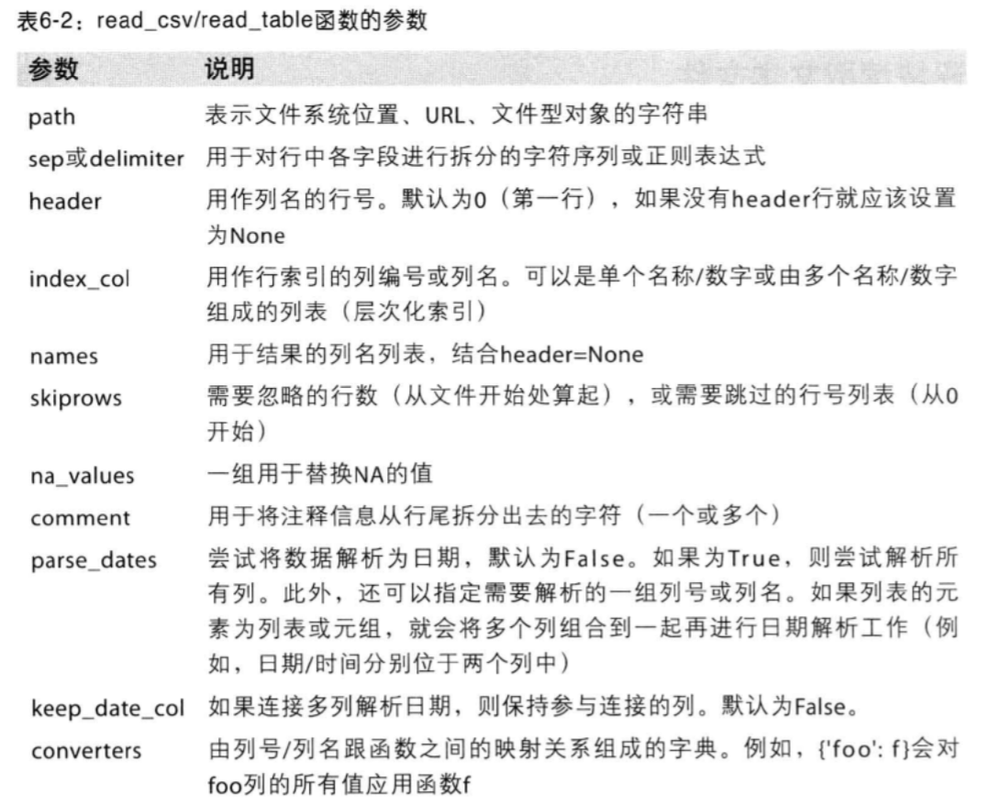
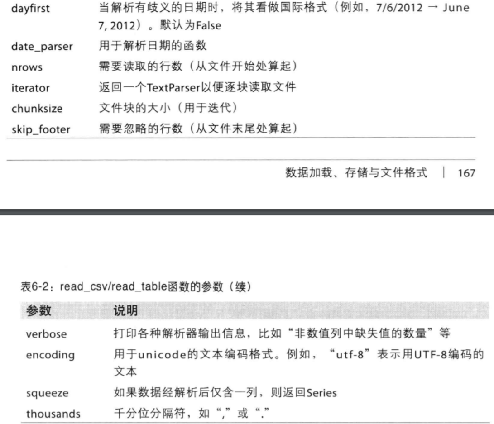

[toc]

> 经常遇到Python读取excel和csv还有其他各种文件的内容。json还有web端的读取还是比较简单，但是excel和csv的读写是很麻烦。这里记录了`pandas`库提供的方法来实现文本内容和`DataFrame`的转化。

## 一、读取文本格式数据

首先来看一下针对不同格式的文件的读取函数：


**总结一下常见参数：（例子见下面代码）**

参数 | 作用
- | -
sep | 指定分隔符,可以是正则表达式
header | 设置为None时处理没有header的文件
names | 指定列
index_col | 将列做成索引，可传入列表，可体现层次
skiprows | 跳过注释行
na_values | 接收表示缺失值的列表或字典

<br>


```python
import pandas as pd
import numpy as np
import sys
import pymysql
df = pd.read_csv('ex1.csv')
print(df)
```
       a   b   c   d message
    0  1   2   3   4   hello
    1  5   6   7   8   world
    2  9  10  11  12     foo
    

```python
df = pd.read_table('ex1.csv',sep=',') #可以使用read_table，但必须指定分隔符
# sep还可以是正则表达式
print(df)
```
       a   b   c   d message
    0  1   2   3   4   hello
    1  5   6   7   8   world
    2  9  10  11  12     foo
    


```python
df = pd.read_csv('ex2.csv',header = None)#不是每一个csv都有header
print(df)
```
       0   1   2   3      4
    0  1   2   3   4  hello
    1  5   6   7   8  world
    2  9  10  11  12    foo
    


```python
df = pd.read_csv('ex2.csv',names=['a','b','c','d','names'])#指定名字
print(df)
```
       a   b   c   d  names
    0  1   2   3   4  hello
    1  5   6   7   8  world
    2  9  10  11  12    foo
    


```python
names=['a','b','c','d','names']
df = pd.read_csv('ex2.csv',names=names,index_col='names') #将names做成索引
print(df)
#names对应三个，abcd分别有对应的
```
           a   b   c   d
    names               
    hello  1   2   3   4
    world  5   6   7   8
    foo    9  10  11  12
    


```python
df = pd.read_csv('csv_mindex.csv')
print('原始样子：','\n',df)
df = pd.read_csv('csv_mindex.csv',index_col=['keys','key2'])
#层次化索引.
#请注意keys和key2的顺序
print(df)
```
    原始样子： 
       keys key2  value1  value2
    0  one    a       1       2
    1  one    b       3       4
    2  two    a       9      10
    3  two    c      13      14
               value1  value2
    keys key2                
    one  a          1       2
         b          3       4
    two  a          9      10
         c         13      14
    

```python
df = pd.read_csv('ex4.csv')
print('原始样子：','\n',df)
#跳过文件的第几行
print()
df = pd.read_csv('ex4.csv',skiprows=[0,2])
print(df)
```
    原始样子： 
                                                               # hey!
    a                                           b   c   d    message
    # just wanted to make things more difficult NaN NaN NaN      NaN
    1                                           2   NaN 4      hello
    
       a  b   c  d message
    0  1  2 NaN  4   hello
    


```python
pd.isnull(df)# 处理缺失值
df = pd.read_csv('ex4.csv',skiprows=[0,2],na_values=['hello'])# 接收一组用于表示缺失值的字符串
print(df)
print(pd.isnull(df))
```
       a  b   c  d  message
    0  1  2 NaN  4      NaN
           a      b     c      d  message
    0  False  False  True  False     True
    


```python
sentinels = {'message':['foo','NA'],'d':['a','NaN']}# 用一个字典为各列指定不同的NA标记值
df = pd.read_csv('ex4.csv',skiprows=[0,2],na_values=sentinels)
print(df)
```
       a  b   c  d message
    0  1  2 NaN  4   hello
    


这里，给出了更详细的参数情况:






## 二、逐块读取文本文件 

这里还是参数的调整问题。由于参数过少，这里不做统一整理。

```python
# nrows参数指定只读取定行。算上第一行哦
pd.read_csv('ex1.csv',nrows=4)
```


<div>
<style>
    .dataframe thead tr:only-child th {
        text-align: right;
    }

    .dataframe thead th {
        text-align: left;
    }

    .dataframe tbody tr th {
        vertical-align: top;
    }
</style>
<table border="1" class="dataframe">
  <thead>
    <tr style="text-align: right;">
      <th></th>
      <th>a</th>
      <th>b</th>
      <th>c</th>
      <th>d</th>
      <th>message</th>
    </tr>
  </thead>
  <tbody>
    <tr>
      <th>0</th>
      <td>1</td>
      <td>2</td>
      <td>3</td>
      <td>4</td>
      <td>hello</td>
    </tr>
    <tr>
      <th>1</th>
      <td>5</td>
      <td>6</td>
      <td>7</td>
      <td>8</td>
      <td>world</td>
    </tr>
    <tr>
      <th>2</th>
      <td>9</td>
      <td>10</td>
      <td>11</td>
      <td>12</td>
      <td>foo</td>
    </tr>
  </tbody>
</table>
</div>


```python
# chunksize 指定分块读取
chunks = pd.read_csv('ex1.csv',chunksize=2)
print(chunks)
```
    <pandas.io.parsers.TextFileReader object at 0x0000007D7E4A39B0>
    

```python
for chunk in chunks:
    print(chunk)
    print('='*10,)
```
       a  b  c  d message
    0  1  2  3  4   hello
    1  5  6  7  8   world
    ==========
       a   b   c   d message
    2  9  10  11  12     foo
    ==========
    

## 三、将数据写出到文本格式


```python
data = pd.read_csv('ex1.csv',nrows=3)
```


```python
data.to_csv('ex1_1.csv') #to_csv写入
```

```python
data.to_csv('ex1_2.csv',sep='|')# 别的分隔符
```
```python
data.to_csv('ex1_1.csv',na_rep='NULL')# 缺失值会被替换为na_rep
```

```python
data.to_csv(sys.stdout,index=False,header=False) 
# 行、列标签被禁止
# 输出到控制台
```
    1,2,3,4,hello
    5,6,7,8,world
    9,10,11,12,foo
    


```python
data.to_csv(sys.stdout,index=False,columns=['a','b'])
```
    a,b
    1,2
    5,6
    9,10
    


```python
data.to_csv(sys.stdout)
```
    ,a,b,c,d,message
    0,1,2,3,4,hello
    1,5,6,7,8,world
    2,9,10,11,12,foo
    

## 四、DataFrame和数据库


```python
# 可以将json格式的数据传给DataFreame
# 也可以数据将数据库的rows传给DataFrame
```


```python
conn = pymysql.Connect(host='172.31.238.166',port=3306,user='luowang',passwd='root',\
                      charset='UTF8',db='dyx')
cursor=conn.cursor()
sql='select * from access_log';
cursor.execute(sql)
rows= cursor.fetchall()
print(cursor.description)
```
    (('aid', 3, None, 16, 16, 0, False), ('site_id', 3, None, 16, 16, 0, False), ('count', 3, None, 32, 32, 0, False))
    


```python
# cursor.description第一个保存了列的信息
# pd.DataFrame(rows,columns=[i[0] for i in cursor.description])
pd.DataFrame(list(rows),columns=[i[0] for i in cursor.description]) #rows必须是list类型
```


<div>
<style>
    .dataframe thead tr:only-child th {
        text-align: right;
    }

    .dataframe thead th {
        text-align: left;
    }

    .dataframe tbody tr th {
        vertical-align: top;
    }
</style>
<table border="1" class="dataframe">
  <thead>
    <tr style="text-align: right;">
      <th></th>
      <th>aid</th>
      <th>site_id</th>
      <th>count</th>
    </tr>
  </thead>
  <tbody>
    <tr>
      <th>0</th>
      <td>1</td>
      <td>1</td>
      <td>45</td>
    </tr>
    <tr>
      <th>1</th>
      <td>2</td>
      <td>3</td>
      <td>100</td>
    </tr>
    <tr>
      <th>2</th>
      <td>3</td>
      <td>1</td>
      <td>230</td>
    </tr>
    <tr>
      <th>3</th>
      <td>4</td>
      <td>2</td>
      <td>10</td>
    </tr>
    <tr>
      <th>4</th>
      <td>5</td>
      <td>5</td>
      <td>205</td>
    </tr>
    <tr>
      <th>5</th>
      <td>6</td>
      <td>4</td>
      <td>13</td>
    </tr>
    <tr>
      <th>6</th>
      <td>7</td>
      <td>3</td>
      <td>220</td>
    </tr>
    <tr>
      <th>7</th>
      <td>8</td>
      <td>5</td>
      <td>545</td>
    </tr>
    <tr>
      <th>8</th>
      <td>9</td>
      <td>3</td>
      <td>201</td>
    </tr>
    <tr>
      <th>9</th>
      <td>10</td>
      <td>10</td>
      <td>10</td>
    </tr>
    <tr>
      <th>10</th>
      <td>11</td>
      <td>11</td>
      <td>11</td>
    </tr>
  </tbody>
</table>
</div>

***

> 欢迎进一步交流本博文相关内容：<br>
博客园地址 : <http://www.cnblogs.com/AsuraDong/><br>
CSDN地址 : <http://blog.csdn.net/asuradong><br>
也可以致信进行交流 : <xiaochiyijiu@163.com> <br>
欢迎关注个人微博：<http://weibo.com/AsuraDong><br>
**欢迎转载** , 但*请指明出处 &nbsp;:&nbsp;&nbsp;)*

***