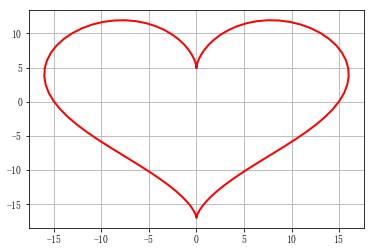
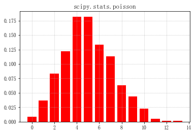

```python
import numpy as np
import matplotlib as mpl
import matplotlib.pyplot as plt
import math
import time
from scipy import stats
from mpl_toolkits.mplot3d import Axes3D
from matplotlib import cm

mpl.rcParams['font.sans-serif'] = ['FangSong']
mpl.rcParams['axes.unicode_minus']=False
```

## 一、绘图介绍

### Bar柱状图(和之后的直方图不同)


```python
x = np.arange(0,10,0.1)
y = np.sin(x)
plt.bar(x,y,width=0.04,linewidth=0.2)
plt.plot(x,y,'r--',linewidth=2)
plt.title('Sin曲线')
plt.xlabel('X')
plt.ylabel('Y')
plt.show()
```


### 屁股线
    f(x) = x**x when x>0 and (-x)**(-x) when x<0


```python
def f(x):
    y = np.ones(x.shape)
    i = x>0
    y[i] = np.power(x[i],x[i])
    i = x<0
    y[i] = np.power(-x[i],-x[i])
    return y

x = np.linspace(-1.3,1.3,101)
y = f(x)
plt.plot(x,y,'g-',label='x^x',linewidth = 2)
plt.grid()
plt.legend(loc='upper left')
plt.show()
```


### 心形线


```python
t = np.linspace(0,2*np.pi,100)
x = 16*np.sin(t)**3
y = 13*np.cos(t)-5*np.cos(2*t)-2*np.cos(3*t)-np.cos(4*t)
plt.plot(x,y,'r-',linewidth = 2)
plt.grid(True)
plt.show()
```





### 胸型线


```python
x = np.arange(1,0,-0.001)
y = (-3 * x * np.log(x) + np.exp(-(40 * (x - 1 / np.e)) ** 4) / 25) / 2 #注意这里在1/e取极值，给它一个智力的波动
plt.figure(figsize=(5,7))
plt.plot(y,x,'r-',linewidth = 2) #注意这里是y，x
plt.grid(True)
plt.title('胸型线',fontsize = 20)
plt.show()
```


### 渐开线


```python
t = np.linspace(0, 50, num=1000)
x = t*np.sin(t) + np.cos(t)
y = np.sin(t) - t*np.cos(t)
plt.plot(x, y, 'r-', linewidth=2)
plt.grid()
plt.show()
```


### 正态分布概率密度函数


```python
######## 高斯分布/正态分布###############

mu = 0
sigma = 1
x  = np.linspace(mu-3*sigma,mu+3*sigma,51)
y =  np.exp(-(x-mu)**2/(2*sigma**2))/(np.sqrt(2*np.pi)*sigma)

plt.figure()
#plt.plot(x,y,'ro-',linewidth=2)
plt.plot(x,y,'ro-',x,y,'g*',linewidth=2,markersize = 3)

plt.xlabel('X',fontsize = 15)
plt.ylabel('Y',fontsize=15)
plt.title(r'Normal distribution',fontsize =18)
#plt.grid(True)
plt.savefig('NormalDistribution.png')
plt.show()
```


### 损失函数：Logistic损失(-1,1)/SVM Hinge损失/ 0/1损失


```python
plt.figure(figsize=(10,8))
x = np.linspace(start=-2, stop=3, num=1001, dtype=np.float)
y_logit = np.log(1 + np.exp(-x)) / math.log(2) #Logistic损失（取对数）
y_boost = np.exp(-x)
y_01 = x < 0
y_hinge = 1.0 - x
y_hinge[y_hinge < 0] = 0
plt.plot(x, y_logit, 'r-', label='Logistic Loss', linewidth=2)
plt.plot(x, y_01, 'g-', label='0/1 Loss', linewidth=2)
plt.plot(x, y_hinge, 'b-', label='Hinge Loss', linewidth=2)
plt.plot(x, y_boost, 'm--', label='Adaboost Loss', linewidth=2)
plt.grid()
plt.legend(loc='upper right')
plt.savefig('1.png')
plt.show()
```


## 二、概率分布


### 均匀分布（散点图）


```python
x = np.random.rand(10000) #每个的概率
t = np.arange(len(x))
plt.plot(t,x,'g.',label="Uniform Distribution")
plt.legend(loc="upper left")
plt.grid()
plt.show()
```


### 概率分布（直方图）


```python
x = np.random.rand(10000)
#x = [1,2,1]
plt.hist(x,25,color="m",alpha=0.37,label="Uniform Distribution")#直方图
plt.legend(loc="upper left")
plt.grid()
plt.show()
```


### 中心极限定理


```python
TIMES = 1000
SIZE = 10000
resultArr = np.zeros(SIZE)
for i in range(TIMES):
    resultArr += np.random.uniform(-5,5,SIZE)
resultArr = resultArr / TIMES
plt.hist(resultArr,bins=30,color='g',alpha = 0.3,label="Uniform Distribution")
plt.legend(loc="upper right")
plt.grid()
plt.show()
```


### 其他的中心极限定理


```python
lamda = 7
p = stats.poisson(lamda)
y = p.rvs(size=1000)
mx = 30
r = (0, mx)
bins = r[1] - r[0]
plt.figure(figsize=(15, 8), facecolor='w')
plt.subplot(121)
plt.hist(y, bins=bins, range=r, color='g', alpha=0.8, normed=True)
t = np.arange(0, mx+1)
plt.plot(t, p.pmf(t), 'ro-', lw=2)
plt.grid(True)

N = 1000
M = 10000
plt.subplot(122)
a = np.zeros(M, dtype=np.float)
p = stats.poisson(lamda)
for i in np.arange(N):
    a += p.rvs(size=M)
a /= N
plt.hist(a, bins=20, color='g', alpha=0.8, normed=True)
plt.grid(b=True)
plt.show()
```


### Possion分布


```python

x = np.random.poisson(lam=5, size=10000)
print (x)
pillar = 15
a = plt.hist(x, bins=pillar, normed=True, range=[0, pillar], color='g', alpha=0.5)
plt.grid()
plt.show()
print (a[1])
print('-'*10)
print (a[0].sum())
```

    [5 4 4 ..., 4 2 3]
    


    [  0.   1.   2.   3.   4.   5.   6.   7.   8.   9.  10.  11.  12.  13.  14.
      15.]
    ----------
    1.0
    


```python
size = 1000
lamda = 5
p = np.random.poisson(lam=lamda, size=size)
plt.figure()
plt.hist(p, bins=range(3 * lamda), histtype='bar', align='left', color='r', rwidth=0.8, normed=True)
plt.grid(b=True, ls=':')
# plt.xticks(range(0, 15, 2))
plt.title('Numpy.random.poisson', fontsize=13)

plt.figure()
r = stats.poisson(mu=lamda)
p = r.rvs(size=size)
plt.hist(p, bins=range(3 * lamda), color='r', align='left', rwidth=0.8, normed=True)
plt.grid(b=True, ls=':')
plt.title('scipy.stats.poisson', fontsize=13)
plt.show()
```





### 插值


```python
rv = np.random.poisson(5)
x1 = a[1]
y1 = rv.pmf(x1)
itp = BarycentricInterpolator(x1, y1)  # 重心插值
x2 = np.linspace(x.min(), x.max(), 50)
y2 = itp(x2)
cs = sp.interpolate.CubicSpline(x1, y1)       # 三次样条插值
plt.plot(x2, cs(x2), 'm--', linewidth=5, label='CubicSpine')           # 三次样条插值
plt.plot(x2, y2, 'g-', linewidth=3, label='BarycentricInterpolator')   # 重心插值
plt.plot(x1, y1, 'r-', linewidth=1, label='Actural Value')             # 原始值
plt.legend(loc='upper right')
plt.grid()
plt.show()
```


    ---------------------------------------------------------------------------

    AttributeError                            Traceback (most recent call last)

    <ipython-input-44-28524b0e3309> in <module>()
          1 rv = np.random.poisson(5)
          2 x1 = a[1]
    ----> 3 y1 = rv.pmf(x1)
          4 itp = BarycentricInterpolator(x1, y1)  # 重心插值
          5 x2 = np.linspace(x.min(), x.max(), 50)
    

    AttributeError: 'int' object has no attribute 'pmf'


## 三、 绘制3D图像


```python
x, y = np.mgrid[-3:3:7j, -3:3:7j]
print (x)
print (y)
u = np.linspace(-3, 3, 101)
x, y = np.meshgrid(u, u) #注意meshgrid的用法
print (x)
print (y)
z = x*y*np.exp(-(x**2 + y**2)/2) / math.sqrt(2*math.pi)
# z = x*y*np.exp(-(x**2 + y**2)/2) / math.sqrt(2*math.pi)
fig = plt.figure()
ax = fig.add_subplot(111,projection='3d')
# ax.plot_surface(x, y, z, rstride=5, cstride=5, cmap=cm.coolwarm, linewidth=0.1)  #
ax.plot_surface(x, y, z, rstride=3, cstride=3, cmap=cm.gist_heat, linewidth=0.5)
plt.show()
```

    [[-3. -3. -3. -3. -3. -3. -3.]
     [-2. -2. -2. -2. -2. -2. -2.]
     [-1. -1. -1. -1. -1. -1. -1.]
     [ 0.  0.  0.  0.  0.  0.  0.]
     [ 1.  1.  1.  1.  1.  1.  1.]
     [ 2.  2.  2.  2.  2.  2.  2.]
     [ 3.  3.  3.  3.  3.  3.  3.]]
    [[-3. -2. -1.  0.  1.  2.  3.]
     [-3. -2. -1.  0.  1.  2.  3.]
     [-3. -2. -1.  0.  1.  2.  3.]
     [-3. -2. -1.  0.  1.  2.  3.]
     [-3. -2. -1.  0.  1.  2.  3.]
     [-3. -2. -1.  0.  1.  2.  3.]
     [-3. -2. -1.  0.  1.  2.  3.]]
    [[-3.   -2.94 -2.88 ...,  2.88  2.94  3.  ]
     [-3.   -2.94 -2.88 ...,  2.88  2.94  3.  ]
     [-3.   -2.94 -2.88 ...,  2.88  2.94  3.  ]
     ..., 
     [-3.   -2.94 -2.88 ...,  2.88  2.94  3.  ]
     [-3.   -2.94 -2.88 ...,  2.88  2.94  3.  ]
     [-3.   -2.94 -2.88 ...,  2.88  2.94  3.  ]]
    [[-3.   -3.   -3.   ..., -3.   -3.   -3.  ]
     [-2.94 -2.94 -2.94 ..., -2.94 -2.94 -2.94]
     [-2.88 -2.88 -2.88 ..., -2.88 -2.88 -2.88]
     ..., 
     [ 2.88  2.88  2.88 ...,  2.88  2.88  2.88]
     [ 2.94  2.94  2.94 ...,  2.94  2.94  2.94]
     [ 3.    3.    3.   ...,  3.    3.    3.  ]]
    


```python
cmaps = [('Perceptually Uniform Sequential',
          ['viridis', 'inferno', 'plasma', 'magma']),
         ('Sequential', ['Blues', 'BuGn', 'BuPu',
                         'GnBu', 'Greens', 'Greys', 'Oranges', 'OrRd',
                         'PuBu', 'PuBuGn', 'PuRd', 'Purples', 'RdPu',
                         'Reds', 'YlGn', 'YlGnBu', 'YlOrBr', 'YlOrRd']),
         ('Sequential (2)', ['afmhot', 'autumn', 'bone', 'cool',
                             'copper', 'gist_heat', 'gray', 'hot',
                             'pink', 'spring', 'summer', 'winter']),
         ('Diverging', ['BrBG', 'bwr', 'coolwarm', 'PiYG', 'PRGn', 'PuOr',
                        'RdBu', 'RdGy', 'RdYlBu', 'RdYlGn', 'Spectral',
                        'seismic']),
         ('Qualitative', ['Accent', 'Dark2', 'Paired', 'Pastel1',
                          'Pastel2', 'Set1', 'Set2', 'Set3']),
         ('Miscellaneous', ['gist_earth', 'terrain', 'ocean', 'gist_stern',
                            'brg', 'CMRmap', 'cubehelix',
                            'gnuplot', 'gnuplot2', 'gist_ncar',
                            'nipy_spectral', 'jet', 'rainbow',
                            'gist_rainbow', 'hsv', 'flag', 'prism'])]
```


```python

```
