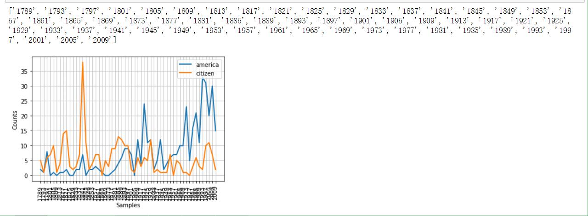
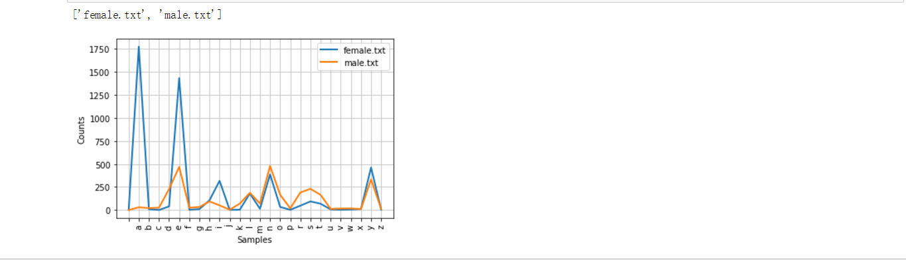

[TOC]

## 语料库基本函数表
| 示例 | 描述 |
| - | -: |
|fileids() | 语料库中的文件 |
|fileids([categories]) | 对应分类中的语料库文件 |
|categories()| 语料库的分类 |
|categories([fileids]) | 文件对应的语料库分类 |
| raw(fileids=[f1,f2..],categories=[c1,c2...]) | 对应文件和分类中原始内容。参数可以式空|
| words(fileids=[f1,f2..],categories=[c1,c2...]) | 对应文件和分类的词汇。参数可以空|
| sents() | sents(fileids=[f1,f2..],categories=[c1,c2...]) | 对应句子，参数可以空 |
| abspath(fileid) | 文件在磁盘的位置 |
| encoding(fileid) | 文件的编码 |
| open(fileid) | 打开文件流 |
| root() | 本地语料库corpus的位置 |
| readme() | README文件的内容 |

***

## 文本语料库分类
1. 最简单的是孤立的文本集合
2. 按照文本等标签分类组成结构，如：布朗语料库
3. 分类不严格，会重叠的语料库，如：路透社语料库
4. 随时间/语言用法改变的语料库 ，如：就职演说库

***

## 常见语料库及其用法
> 注意`nltk.Text(string)` 返回类似text1的Text对象

#### 古藤堡语料库
包含36000本电子书，可以在[这里下载](http://www.gutenberg.org/)
```python
from nltk.corpus import gutenberg
print(gutenberg.fileids())

emma= gutenberg.words('austen-emma.txt')
print(gutenberg.raw('austen-emma.txt'))
emma = nltk.Text(emma)#
print(emma[:10])
```

#### 网络&&聊天体
> 网络text主要是非正式文学，论坛交流，剧本，评论等。聊天文本是根据聊天室划分的（文件名包括 日期、聊天室、帖子数量），被划分为15个大文件。

```python
#网络体：webtext
from nltk.corpus import webtext
for fileid in webtext.fileids():
    print(fileid,webtext.raw(fileid)[:50])
```
	[out]
	firefox.txt Cookie Manager: "Don't allow sites that set remove
	grail.txt SCENE 1: [wind] [clop clop clop] 
	KING ARTHUR: Who
	overheard.txt White guy: So, do you have any plans for this even
	pirates.txt PIRATES OF THE CARRIBEAN: DEAD MAN'S CHEST, by Ted
	singles.txt 25 SEXY MALE, seeks attrac older single lady, for 
	wine.txt Lovely delicate, fragrant Rhone wine. Polished lea

```python
#聊天体:nps_chat
from nltk.corpus import nps_chat
chatroom = nps_chat.posts('10-19-20s_706posts.xml')
chatroom[123:125]
```
	[out]
	[['i',
	  'do',
	  "n't",
	  'want',
	  'hot',
	  'pics',
	  'of',
	  'a',
	  'female',
	  ',',
	  'I',
	  'can',
	  'look',
	  'in',
	  'a',
	  'mirror',
	  '.'],
	 ['hi', 'U64']]

#### 布朗语料库
> 百万词级语料库，没啥好说的。按照文本分类，如新闻、社论等。

```python
from nltk.corpus import brown
print(brown.categories())
print(brown.fileids())
```
因为这个语料库是研究文本间系统性差异的资源，所以可以来比较一下不同文本中情态动词的用法。
```python
import nltk
from nltk.corpus import brown
news = brown.words(categories='news')
fdist = nltk.FreqDist([w.lower() for w in news])
modals= ['can','could','may','might','must','will']
for m in modals:
    print(m,':',fdist[m])
```

#### 路透社语料库
> 新闻文档，分为“训练”和“测试”两组。便于及其进行训练和测试。命名就是'test/number'和'training/number'

```python
from nltk.corpus import reuters
print(reuters.fileids())
print(reuters.categories())
```

#### 就职演说语料库
> 感觉这算是美国特色吧。因为命名采用'year-name.txt'的格式，我们可以提取出来时间维度，并且做个折线图来统计特定词汇的出现频率（不同年代中）

```python
from nltk.corpus import inaugural
print(list(f[:4]for f in inaugural.fileids()))
#下面体现American和citizen随时间推移使用情况
cfd = nltk.ConditionalFreqDist(\
                              (target,fileid[:4])\
                              for fileid in inaugural.fileids()\
                              for w in inaugural.words(fileid)\
                              for target in ['america','citizen']\
                               if w.lower().startswith(target))
cfd.plot()
```
感受一下效果图（附截图）



***

## 载入自定义语料库
> 如果想操作自己的语料库，并且使用之前的方法，那么，需要`PlaintextCorpusReader` 函数来载入他们，这个函数参数有两个，第一个是根目录，第二个是子文件（可以使用正则表达式进行匹配）

```python
from nltk.corpus import PlaintextCorpusReader
root = r'C:\Users\Asura-Dong\Desktop\tem\dict'
wordlist = PlaintextCorpusReader(root,'.*')#匹配所有文件
print(wordlist.fileids())
print(wordlist.words('tem1.txt'))
```
	输出结果：
	['README', 'tem1.txt']
	['hello', 'world']

***

## 词典资源
> 词典：包括词性和注释信息。

### 停用词语料库
stopwords即是，遗憾的是没有中文停用词

```python
from nltk.corpus import stopwords
#定义一个计算func计算不在停用词列表中的比例的函数
def content(text):
    stopwords_eng = stopwords.words('english')
    content = [w for w in text if w.lower() and w not in stopwords_eng]
    return len(content)/len(text)
print(content(nltk.corpus.reuters.words()))
```

####  名字词典
> 就两部分组成，男性和女性的英文名字。这里我们研究一下最后一个名字最后一个字母和性别的关系

```python
names = nltk.corpus.names
print(names.fileids())
male = names.words('male.txt')
female = names.words('female.txt')
cfd = nltk.ConditionalFreqDist((fileid,name[-1]) for fileid in names.fileids() for name in names.words(fileid))
cfd.plot()
```
(附截图)


#### 发音词典
> 这个更神奇，竟然是为了发音合成准备的。以后通读这本书后，也想想怎么迁移到中文上。

引入 `nltk.corpus.cmudict` 后，我们可以得到它音素的长度，由此可以**找到押韵的词语**。
```python
s = ['N','IHO','K','S']
entries = nltk.corpus.cmudict.entries()
print('Example:',entries[0])
word_list = [word for word,pron in entries if pron[-4:]==s]
print(word_list)
```

在因素表中，我们会发现数字：1，2，0。分别代表着：主重音、次重音、无重音。
这里我们可以定义一个function，**找到具有特定重音模式的词汇**。
```python
def func(pron):
    return [char for phone in pron for char in phone if char.isdigit()]
word_list = [w for w,pron in entries if func(pron)==['0','1','0','2','0']]
print(word_list)
```

***

## WordNet面向语义的英语字典
> 最后必须说一下这个字典。WordNet是由Princeton 大学的心理学家，语言学家和计算机工程师联合设计的一种基于认知语言学的英语词典。它不是光把单词以字母顺序排列，而且按照单词的意义组成一个“单词的网络”。

#### 引入和同义词
motorcar和automobile是同义词，可以借助wordnet来研究。
```python
from nltk.corpus import wordnet as wn
wn.synsets('motorcar')
```
结果是：[Synset('car.n.01')]。说明motorcar **只有一个** 可能的含义。car.n.01被称为“同义 **词集** ”。我们可以通过`wn.synset('car.n.01').lemma_names` 来查看当前同义词集的其他词 (car这个单词就有很多个同义词集了) 。`wn.synset('car.n.01').examples` 和`wn.synset('car.n.01').definition` 可以分别查看定义和例子（但是Python3里面不可以。）<br>
而类似car.n.01.car这样的处于下一级的称之为**词条**。
对于词条级别的obj，可以看下面的操作。
```python
print(wn.synset('car.n.01').lemmas)
wn.lemma('car.n.01.automobile').name
wn.lemma('car.n.01.automobile').synset
```

#### 上位词、下位词、反义词
> 上位词（hypernym），指概念上外延更广的主题词。 例如：”花”是”鲜花”的上位词，”植物”是”花”的上位词，”音乐”是”mp3”的上位词。反过来就是下位词了。

上位词和下位词通过`hyponyms()` 和 `root_hypernyms()` 来访问。
```python
motorcar = wn.synset('car.n.01').hyponyms()#下位词
car = wn.synset('car.n.01').root_hypernyms()
```

反义词就通过`antonyms()` 来访问

#### 其他词集关系
> 之前是从上->到下，或者反过来。更重要的是从整体->局部，或者反过来。如大树和树冠、树干的关系，这些是`part_meronyms()` 。而大树集合就成了森林，`member_holonyms()` 。而树的实质是心材和边材组成，即`substance_meronyms()`。

### 语义相似度
当两个单词有相同的上位词（在词树中寻找），而若上位词恰好属于较低层，那么它们会有一定密切联系。
```python
right = wn.synset('right_whale.n.01')
orca = wn.synset('orca.n.01')
print(right.lowest_common_hypernyms(orca))
```
当然，类似于树的结构中总是有神的，可以通过`min_depth()` 来查看一个synset的最小深度。基于这些，我们可以在0-1的范围内返回相似度。对于上面的代码，查看相似度：`right.path_similarity(orca)`。<br>
> 这些数字大小意义不大。但是当鲸鱼和鲸鱼、鲸鱼和小说来比较时，数字是减小的。对比着看大小，还是有意义的。