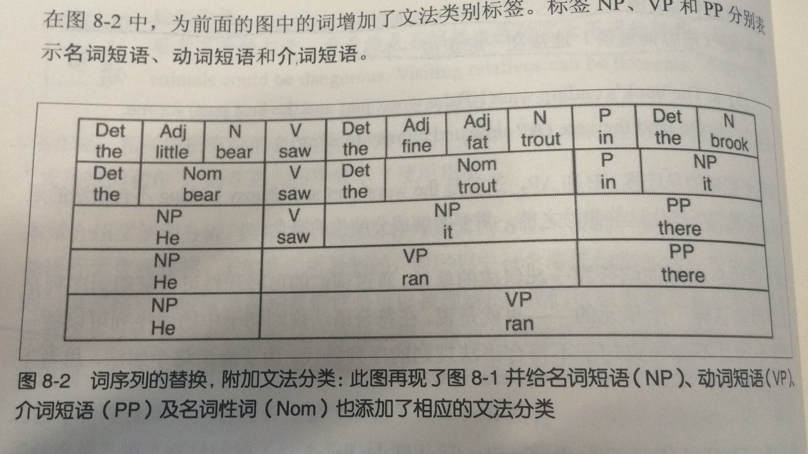
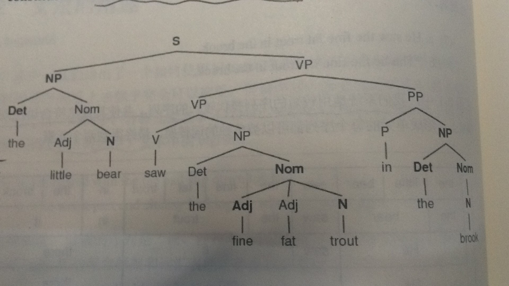
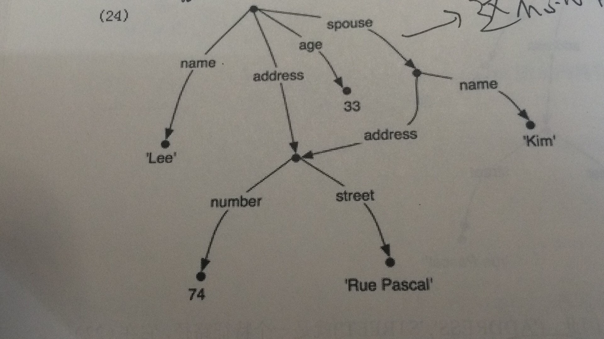

[TOC]

对于一门语言来说，一句话有无限可能。问题是我们只能通过有限的程序来分析结构和含义。尝试将“语言”理解为：仅仅是所有合乎文法的句子的大集合。在这个思路的基础上，类似于 `word -> word and/or/... word` 就成立，这种式子叫做递归产生式。理论上，句子可以无限扩充。

## **文法**

### **自定义文法**

写法上与上一篇博文的分类规则思路基本一致，并且更简单、更直观，可以和之前的对比着看。
```python
import nltk
from nltk import CFG

grammar = nltk.CFG.fromstring("""
  S -> NP VP
  VP -> V NP | V NP PP
  PP -> P NP
  V -> "saw" | "ate" | "walked"
  NP -> "John" | "Mary" | "Bob" | Det N | Det N PP
  Det -> "a" | "an" | "the" | "my"
  N -> "man" | "dog" | "cat" | "telescope" | "park"
  P -> "in" | "on" | "by" | "with"
  """)
sent = 'Mary saw Bob'.split()
rd_parser = nltk.RecursiveDescentParser(grammar)
for i in rd_parser.parse(sent):
    print(i)
```
在定义文法的时候，`NP->'New York'`应该写成 `NP->'New_York'`，连接作用的空格应该用`_`代替。

### **文法用途**

语言基本可以说是由修饰结构和并列结构拼接而成（不喜勿喷）。比如下面这样不断的扩充：
1. he ran
2. he ran there
3. he saw it there
4. the bear saw the font in it

显然正常的句子是第四句，如果将上述过程倒过来从4->1。最终就可以得到两个元素。也就是说：再复合语法规则句子中的词序列可以被一个更小的且不会导致句子不符合语法规则的序列代替。下面两张图，第一张代表词序列的替换。第二张是根据文法规则画出的图。（附截图*2）






### **开发文法**

下面程序展示了利用简单的过滤器，找出带句子补语的动词

```python
from nltk.corpus import treebank
t = treebank.parsed_sents('wsj_0001.mrg')[0]
print(t) #查看封装好的文法

def filter(tree):
    child_nodes = [child.label() for child in tree if isinstance(child,nltk.Tree)]
    return (tree.label() == 'VP') and ('S' in child_nodes)#找出带句子补语的动词

[subtree for tree in treebank.parsed_sents() \
        for subtree in tree.subtrees(filter)]
```

---

## **分析文法的算法**

1. 下降递归分析：自上而下
2. 移进-归约分析：自下而上
3. 左角落分析：自下而上过滤的自上而下的方法
4. 图表法：动态规划技术

以下是前两种分析算法对应的解析器。

### **递归下降解析器**

*三个主要缺点：*
- 左递归产生式：`NP-> NP PP` 会陷入死循环
- 处理不符合句子的词和结构时候浪费时间
- 回溯过程过重会丢掉计算过的分析，重新计算

```python
import nltk
from nltk import CFG
grammar1 = nltk.CFG.fromstring("""
  S -> NP VP
  VP -> V NP | V NP PP
  PP -> P NP
  V -> "saw" | "ate" | "walked"
  NP -> "John" | "Mary" | "Bob" | Det N | Det N PP
  Det -> "a" | "an" | "the" | "my"
  N -> "man" | "dog" | "cat" | "telescope" | "park"
  P -> "in" | "on" | "by" | "with"
  """)
rd_parser = nltk.RecursiveDescentParser(grammar1)
sent = 'Mary saw a dog'.split()
for t in rd_parser.parse(sent):
    print(t)
```

可以调用`nltk.app.rdparser()`来查看分析过程

### **移进-归约解析器**
> 此解析器反复将下个输入词push进堆栈，成为*移位*操作。如果堆栈前n项，匹配表达式右侧的n个项目，弹出栈，并且将产生式左边项目压如栈，称为*归约*操作。

*两个缺点：*
- 由于堆栈的特殊性，只能找到一种解析
- 不能保证一定能找到解析

```python
sr_parse = nltk.ShiftReduceParser(grammar1)
for t in sr_parse.parse(sent):
    print(t)
```

---

## **基于特征的文法**
> 怎么对文法进行更细微的控制，用什么结构来表示？可以将标签分解为类似字典的结构，提取一系列的值作为特征。

### **属性和约束**
首先看一个例子，通过`nltk.data.show_cfg('grammars/book_grammars/feat0.fcfg') ` ：
```
% start S
# ###################
# Grammar Productions
# ###################
# S expansion productions
S -> NP[NUM=?n] VP[NUM=?n]
# NP expansion productions
NP[NUM=?n] -> N[NUM=?n] 
NP[NUM=?n] -> PropN[NUM=?n] 
NP[NUM=?n] -> Det[NUM=?n] N[NUM=?n]
NP[NUM=pl] -> N[NUM=pl] 
# VP expansion productions
VP[TENSE=?t, NUM=?n] -> IV[TENSE=?t, NUM=?n]
VP[TENSE=?t, NUM=?n] -> TV[TENSE=?t, NUM=?n] NP
# ###################
# Lexical Productions
# ###################
Det[NUM=sg] -> 'this' | 'every'
Det[NUM=pl] -> 'these' | 'all'
Det -> 'the' | 'some' | 'several'
PropN[NUM=sg]-> 'Kim' | 'Jody'
N[NUM=sg] -> 'dog' | 'girl' | 'car' | 'child'
N[NUM=pl] -> 'dogs' | 'girls' | 'cars' | 'children' 
IV[TENSE=pres,  NUM=sg] -> 'disappears' | 'walks'
TV[TENSE=pres, NUM=sg] -> 'sees' | 'likes'
IV[TENSE=pres,  NUM=pl] -> 'disappear' | 'walk'
TV[TENSE=pres, NUM=pl] -> 'see' | 'like'
IV[TENSE=past] -> 'disappeared' | 'walked'
TV[TENSE=past] -> 'saw' | 'liked'
```

类似于字典的规则，NUM，TENSE等就是属性，press，sg，pl就是约束。这样我们就能显示指明'the some dogs'这样的句子，而不是'the some dog'。<br>
其中，sg代表单数，pl代表复数，?n代表不确定（皆可）。类似sg，pl这样的特征值称为*原子*，原子也可以是bool值，并且用`+aux` 和 `-aux`分别表示True 和 False。

### **处理特征结构**

NLTK的特征结构使用构造函数`FeatStuct()`来进行声明，原子特征值可以是字符串或者整数。简单示例：
```python
fs1 = nltk.FeatStruct("[TENSE = 'past',NUM = 'sg',AGR=[NUM='pl',GND = 'fem']]")
print(fs1)
print(fs1['NUM'])#可以像字典那样进行访问
```

打印出来发现是*矩阵形式*。为了在矩阵中表示重入，可以在共享特征结构的地方加一个括号包围的数字前缀，例如`(1)`。以后对任意这个结构的引用都使用`(1)`

```python
print(nltk.FeatStruct("""[NAME = 'Lee',ADDRESS=(1)[NUMBER=74,STREET='rue Pascal'],SPOUSE =[NAME='Kim',ADDRESS->(1)]]"""))
```
结果如下：
<pre>
[ ADDRESS = (1) [ NUMBER = 74           ] ]
[               [ STREET = 'rue Pascal' ] ]
[                                         ]
[ NAME    = 'Lee'                         ]
[                                         ]
[ SPOUSE  = [ ADDRESS -> (1)  ]           ]
[           [ NAME    = 'Kim' ]           ]
</pre>

结果可以看成一个图结构，如果没有这种`(num)`，就是有向无环图；有的话，就有环了。（附截图）




### **包含和统一**

如果有两种结构：
```
a.[num = 74]
b.[num = 74]
  [street = 'BeiJing']
```
那么b包含a。类似于集合运算，这个顺序称为*包含*。

*统一*就是合并两个结构，但是如果相同的属性有不同的值，那么会返回None类型。
```
fs1 = nltk.FeatStruct(NUMBER = 74)
fs2 = nltk.FeatStruct(City = 'BeiJint')
#fs2 = nltk.FeatStruct(NUMBER= 45)#返回None
print(fs2.unify(fs1))
```

---

## 总结

> **在NLP中中，简单的说：文法=语法=词法+句法。**<br>
&nbsp;&nbsp;&nbsp;它是语言学的一个分支，研究按确定用法来运用的"词类"、"词"的曲折变化或表示相互关系的其他手段以及词在句中的功能和关系。包含词的构词、构形的规则和组词成句的规则。<br>
&nbsp;&nbsp;&nbsp;由于，不同的文法框架在写法上也有差异，所以在构造的时候需要具体查看相关文档和库的要求。这方面的编程，更多的是在规则的基础上对词和词类的关系进行研究，并且不断完善文法规则。<br>

***

> 欢迎进一步交流本博文相关内容：<br>
博客园地址 : <http://www.cnblogs.com/AsuraDong/><br>
CSDN地址 : <http://blog.csdn.net/asuradong><br>
也可以致信进行交流 : <xiaochiyijiu@163.com> <br>
**欢迎转载** , 但*请指明出处 &nbsp;:&nbsp;&nbsp;)*

***