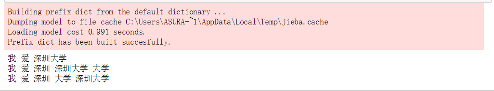
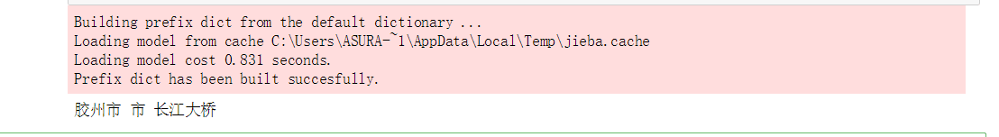
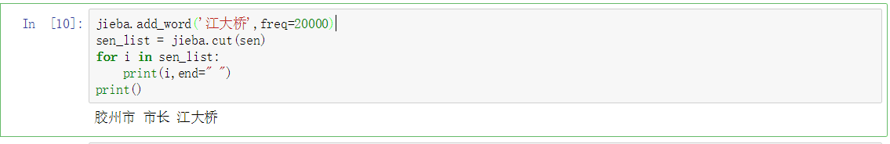
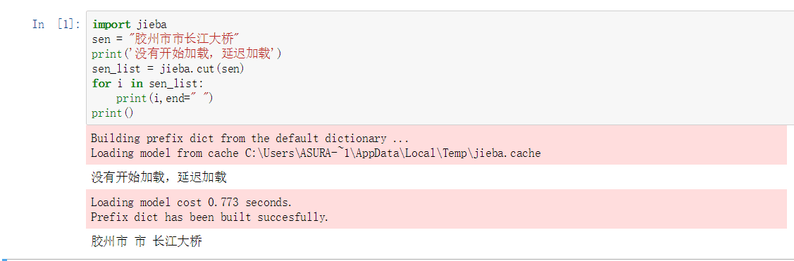

[toc]

> 英文分词的第三方库NLTK不错，中文分词工具也有很多(盘古分词、Yaha分词、Jieba分词等)。但是从加载自定义字典、多线程、自动匹配新词等方面来看。
**大jieba**确实是中文分词中的**战斗机**。

**请随意观看表演**
- [安装](#安装)
- [分词](#分词)
- [自定义词典](#自定义词典)
- [延迟加载](#延迟加载)
- [关键词提取](#关键词提取)
- [词性标注](#词性标注)
- [词语定位](#词语定位)
- [内部算法](#内部算法)

<a id="安装"></a>
## 安装

1. 使用pip包傻瓜安装：`py -3 -m pip install jieba` / `pip install jiba`（windows下推荐第一种，可以分别安装python2和3对应jieba）
2. **[pypi下载地址](https://pypi.python.org/pypi/jieba/)**

<a id="分词"></a>
## 分词

#### 3种模式
1. 精确模式：试图将句子最精确地切开，适合文本分析
2. 全模式：把句子中所有的可以成词的词语都扫描出来（速度快）
3. 搜索引擎模式：在精确模式的基础上，对长词再次切分，提高召回率，适合用于搜索引擎分词

#### 实现方式
1. 精确模式：`jieba.cut(sen)`
2. 全模式：`jieba.cut(sen,cut_all=True)`
3. 搜索引擎模式：`jieba.cut_for_search(sen)`

```python
import jieba
sen = "我爱深圳大学"
sen_list = jieba.cut(sen)
sen_list_all = jieba.cut(sen,cut_all=True)
sen_list_search = jieba.cut_for_search(sen)
for i in sen_list:
    print(i,end=" ")
print()
for i in sen_list_all:
    print(i,end=" ")
print()
for i in sen_list_search:
    print(i,end=" ")
print()
```
结果：附截图



<a id="自定义词典"></a>
## 自定义词典

#### 创建方式

- 后缀：txt
- 格式：词语( 权重 词性 )
- 注意事项：
    1. windows下txt不能用自带的编辑器，否则会乱码。可以用VSCODE，或者其他编辑器
    2. 可以只有词语
    3. 在没有权重的情况下，只有比默认词典长的词语才可以加载进去。附截图
    


#### 加载字典
`jieba.load_userdict(txtFile)`

#### 调整字典
添加词：`jieba.add_word(word,freq=None,tag=None)`

删除词：`jieba.del_word(word)`
```python
import jieba
sen = "胶州市市长江大桥"
sen_list = jieba.cut(sen)
for i in sen_list:
    print(i,end=" ")
print()
```
    胶州市 市 长江大桥
```python
jieba.add_word('江大桥',freq=20000)
sen_list = jieba.cut(sen)
for i in sen_list:
    print(i,end=" ")
print()
```
结果附截图



### 改变主字典
- [占用内存较小的词典文件]( https://github.com/fxsjy/jieba/raw/master/extra_dict/dict.txt.small)
- [支持繁体分词更好的词典文件](https://github.com/fxsjy/jieba/raw/master/extra_dict/dict.txt.big)
- 加载方法：`jieba.set_dictionary('data/dict.txt.big')`

<a id="延迟加载"></a>
## 延迟加载
> 之前发现，词典不是一次性加载的，说明它采用的是延迟加载。即：当遇到应用的时候才会加载。有点类似于python高级特性中的 `yield` （节省内存）

**效果图如下：**


- 手动加载的方法：`jieba.initialize()`

<a id="关键词提取"></a>
## 关键词提取

`jieba.analyse.extract_tags(sentence,topK=20)`:返回topK个TF/IDF权重最大的词语
```python
import jieba.analyse
sen_ana = jieba.analyse.extract_tags(sen,3)
for i in sen_ana:
    print(i)
```
    江大桥
    胶州市
    市长

<a id="词性标注"></a>
## 词性标注
`jieba.posseg.cut(sen)`:返回的每个迭代对象有两个属性-> word 词语 + flag 词性

```python
import jieba.posseg
words = jieba.posseg.cut(sen)
for word in words:
    print(word.flag," ",word.word)
```
    ns   胶州市
    n   市长
    x   江大桥


<a id="词语定位"></a>
## 词语定位
`jieba.tokenize(sen,mode)`:mode可以设置为search，开启搜索模式
```python
index= jieba.tokenize(sen)
for i in index:
    print(i[0],"from",i[1],"to",i[2])
```
    胶州市 from 0 to 3
    市长 from 3 to 5
    江大桥 from 5 to 8

<a id="内部算法"></a>
## 内部算法 
1. 基于Trie树结构实现高效的词图扫描，生成句子中汉字所有可能成词情况所构成的有向无环图（DAG)
2. 采用了动态规划查找最大概率路径, 找出基于词频的最大切分组合
3. 对于未登录词，采用了基于汉字成词能力的HMM模型，使用了Viterbi算法。

#### 参考文献
- [python中jieba分词快速入门](http://blog.sina.com.cn/s/blog_7d8326290102vzpb.html)
- [使用Jieba工具中文分词及文本聚类概念](https://yq.aliyun.com/articles/26040)