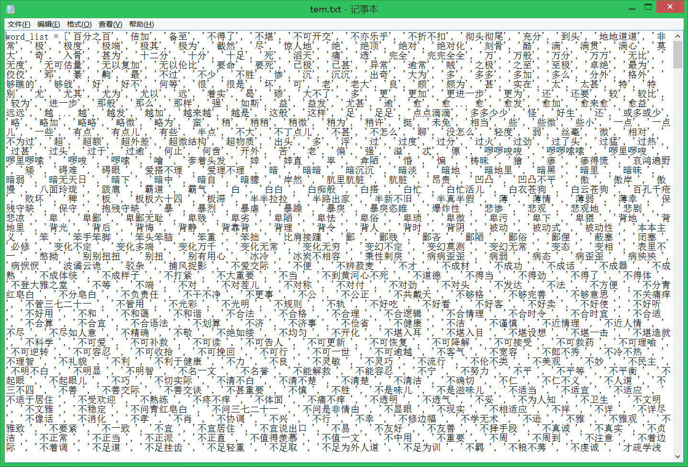
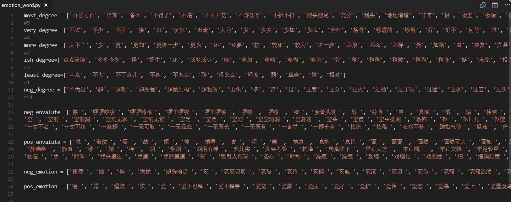
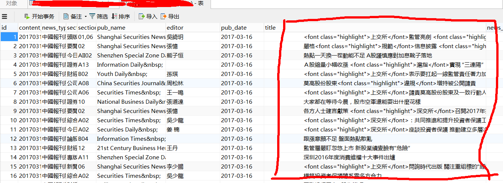
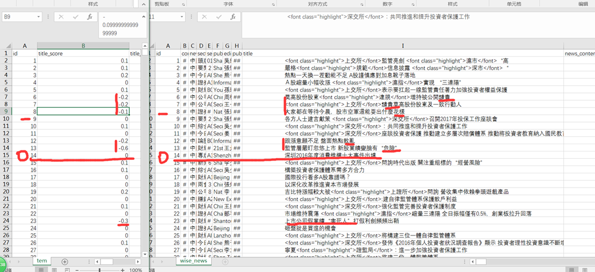
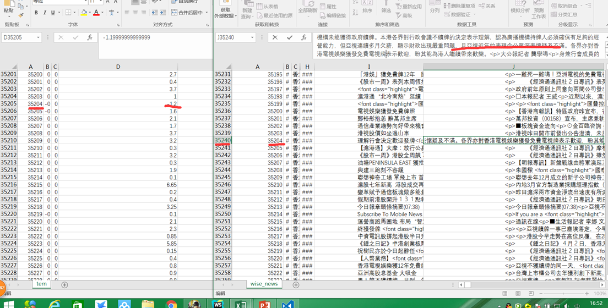
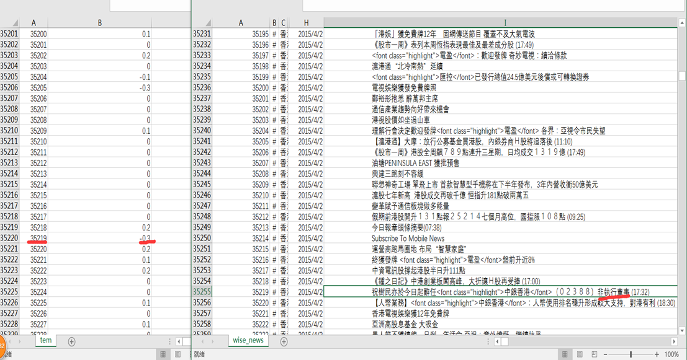

[toc]

# 自然语言之情感分析(中文)


- 数据来源：香港金融新闻平台
- 处理工具：python3.5
- 处理结果：分析语言的积极/消极意义
- 领域：金融/炒股

## 请随意观看表演

- [数据准备](#presentation)
- [数据清洗](#clear)
- [情感分析](#analysis)
- [报错处理](#error)
- [成果展示](#result)
- [遗留问题](#problem)


<a id="presentation"></a>
### No1.数据准备

> 准备工作主要是对字典进行处理，将其按照类型分类写入python文件中，方便其余脚本调用。并且，将词典写入到emotion_word.txt中，使用  **[jieba词库](!(jieba)[https://github.com/AsuraDong/myPyNote/tree/master/%E7%AC%AC%E4%B8%89%E6%96%B9%E5%BA%93])** 重载

##### 将字典写入.py文件好处

1. 方便调用：`from emotion_word import *`
2. 按照类型分类，调用后，直接使用`most_degree`即可，**避免打开txt文件的大量代码**
3. 可以使用python高级结构的方法
4. 附一张emotion_word.py的截图





##### 写入方法

将txt字典中的每行的词语读出来，再写入列表，再`print(List)`。当数据少的时候可以，但是当数据达到几百以上，显然不可行。
若txt字典中的词语都是按行分布的:
```
word_list = []
def main():
    with open('emotion_word.txt','r',encoding="utf-8") as f:
        global word_list
        for line in f.readlines():
            word_list.append(line.strip('\n'))
    with open('tem.txt','a',encoding="utf-8") as f:
        writted = 'word_list = '+str(word_list)+'\n'
        f.write(writted)

if __name__=='__main__':
    main()

```
写入后，再全选复制，粘贴到对应.py文件就可以了
附截图


<a id="clear"></a>
### No2.数据清洗

拿到的数据是这样的，附截图


> 主要就是：繁体去简体，去掉html标签和各种奇葩符号
繁体和简体的转化，用到了国人的一个库，[请戳这里下载 :) ](https://github.com/skydark/nstools/tree/master/zhtools)

使用方法很简单:
```
from langconv import *
#转换繁体到简体
def cht_to_chs(line):
    line = Converter('zh-hans').convert(line)
    line.encode('utf-8')
    return line

#转换简体到繁体
def chs_to_cht(line):
    line = Converter('zh-hant').convert(line)
    line.encode('utf-8')
    return line
```
代码会在之后用类一起封装

<a id="analysis"></a>
### No3.情感分析

> 分析title(新闻标题)和content(新闻主体)的成绩(只看正负)和方差。对于成绩，我们更重视新闻标题，因为关键词明确，数量少，影响因素少；对于方差，我们更看重新闻主体，词语多，从方差可以看出来这段新闻语气程度(肯定/不确定...)。当然，当titile成绩为0或者主体方差为0，我们会看主体的成绩和title的方差。

1. 当前词的正负性(褒义/贬义)
2. 检索前一个词是否是程度词/反义词
3. 后一个词/标点是否能加深程度

**字典特征**
- 字典里面的否定词:'不好',而不是'不','好'。所以否定词是和别的词连在一起的。但也有少数不是。
- 字典包含标点符号
- 字典有一些缺陷，并且不是针对金融领域的专门字典

```
class EmotionAnalysis:
    def __init__(self,news=None):
        self.news = news
        self.list = []

    def __repr__(self):
        return "News:"+self.news
    
    #新闻去标签,繁->简
    def delete_label(self):
        rule = r'(<.*?>)| |\t|\n|○|■|☉'
        self.news = re.sub(rule,'',self.news)
        self.news = cht_to_chs(self.news)

    #得到成绩和方差
    def get_score(self):
        self.list = list(jieba.cut(self.news))
        index_list = zip(range(len(self.list)),self.list)
        score = 0
        mean_list = []
        #tem_list= []
        for (index,word) in index_list:
            #tem_list.append(word)
            tem_score = 0
            
            #print("NO:",index,'WORD:',word)
            if (word in pos_emotion) or (word in pos_envalute):
                tem_score = 0.1
                
                #搜索程度词
                if self.list[index-1] in most_degree and (index-1):
                    tem_score = tem_score*3
                elif self.list[index-1] in very_degree  and (index-1):
                    tem_score = tem_score*2.5
                elif self.list[index-1] in more_degree and (index-1):
                    tem_score = tem_score*2
                elif self.list[index-1] in ish_degree and (index-1):
                    tem_score = tem_score*1.5
                elif self.list[index-1] in least_degree and (index-1):
                    tem_score = tem_score*1
                else:pass
                #搜索否定词/反意词
                if (self.list[index-1] in neg_degree and index!=0)  or  (index<len(self.list)-1 and self.list[index+1] in neg_degree):
                    tem_score = -tem_score
                #print("|  tem_score:",tem_score)

            elif (word in neg_emotion) or (word in neg_envalute):
                tem_score = -0.3
                if self.list[index-1] in most_degree and (index-1):
                    tem_score = tem_score*3
                elif self.list[index-1] in very_degree  and (index-1):
                    tem_score = tem_score*2.5
                elif self.list[index-1] in more_degree and (index-1):
                    tem_score = tem_score*2
                elif self.list[index-1] in ish_degree and (index-1):
                    tem_score = tem_score*1.5
                elif self.list[index-1] in least_degree and (index-1):
                    tem_score = tem_score*1
                else:pass
                #print("|  tem_score:",tem_score)
            mean_list.append(tem_score)
            score+=tem_score
        #print(tem_list)
        #返回(成绩,方差)
        return (score,np.var(mean_list))
```

<a id="error"></a>
### No4.报错处理

> 一共231506条新闻，为了方便回查，设置报错处理(在数据库操作的类里实现)

```
log_file = 'error.log'
class SQL(object):
	......
	def run(self,cmd,index):
        try:
            self.read_SQL(cmd,index)
            self.operate()
            
            self.write_SQL(index)
            self.w_conn.commit()

        except Exception as r:
            self.r_conn.rollback()
            self.w_conn.rollback()

            error = "ID "+str(self.r_dict['id'])+str(r)
            global log_file
            log_error(log_file = log_file,error=error)

```

<a id="result"></a>
### No5.成果展示

> 由于var太小，所以扩大了1w倍，便于观察相对大小和后期工作的进行。请观察id，来观看结果(为了方便显示，导入到了两个csv文件)







<a id="problem"></a>
### No6.遗留问题

- 在EmotionAnalysis类里的get_score函数里，对应的分值容易确定。(有空看一下机器学习，maybe能改进)。所以现在的分数只能看正负，来确定消极或积极。但对于这种金融新闻（特点：言简意赅），效果还可以。
- 字典问题，请看 **No3里面的字典特征**