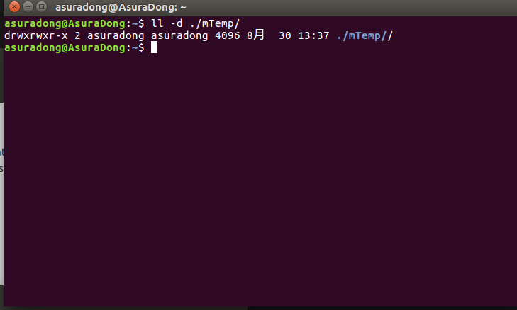

> 一篇记录如何改变文件属性和权限的笔记。

总的来说，有以下四种：
1. `chgrp`:改变文件所属用户组
2. `chown`:改变文件所有者
3. `chmod`:改变文件权限

先来看一张配置图片：

### 0. `chgrp`改变用户组
> 改变的用户组，用户组必须在`/etc/group`中。可以通过：`cat /etc/group`来查看用户组。

命令格式：`sudo chgrp [-R] group dirname/filename`。参数`-R`是进行递归更改，更改所有的子目录和文件。

### 1. `chown`改变所有者
> 改变的所有者，所有者必须在`/etc/passwd`中。可以通过：`cat /etc/passwd`来查看用户。

命令格式：`sudo chown [-R] user dirname/filename`。参数`-R`是进行递归更改，更改所有的子目录和文件。

### 2. `chmod`改变权限
权限和对应的权重：
| 权限 | 权重 |
| :-|-: |
|r，读取 | 4 |
|w，写入 | 2|
|x，运行 | 1|

命令格式：`sudo chmod [-R] xxx dirname/filename`。参数`-R`是进行递归更改，更改所有的子目录和文件。

注意：
1. xxx分别就是user,group,other对应的权限
2. x的值就是`1 2 4`的和

### 3. 常见系统目录的作用
- `/bin`：放置单用户维护模式下能被操作的命令。所以其中的命令一般可以被ｒｏｏｔ和一般账号使用
- `/etc`：系统相关的配置文件（如之前说过的ｐａｓｓｗｄ和ｇｒｏｕｐ）
- `/media`：存放可以删除的设备媒体：例如软盘、Ｕ盘等。
- `/opt`：第三方软件安置的目录
- `/tmp`：如名，暂时存放文件的地方，需要定时清理。