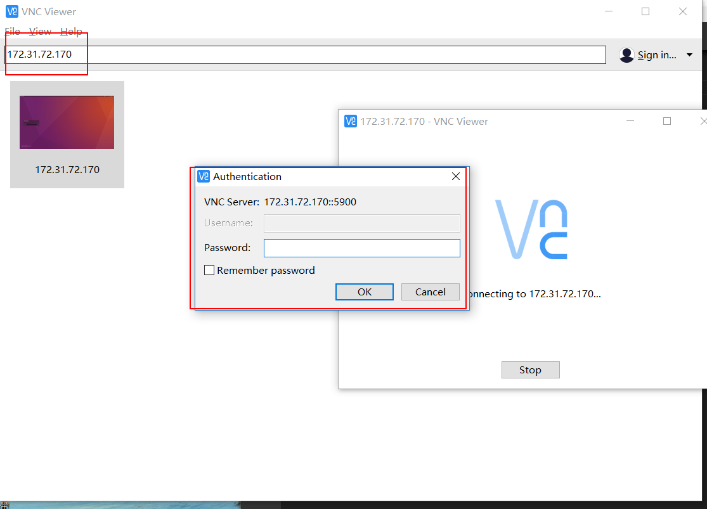

> windows的环境下，远程连接linux。

1. windows平台：安装`VNC Viewer`。

2. Ubuntu平台；在搜索里面打开`桌面共享`。然后配置如下。（*注意，安全的`必须对本机每次访问进行确认`可以不勾选。因为你远程的时候，肯定不在电脑旁边呀。。。*）

3. Ubuntun平台，输入：` sudo apt-get install dconf-editor`。安装 dconf-editor工具，方便配置dconf。

4. 输入`dconf-editor`打开dconf。在`org->gnome->desktop->peripherals->remote-access`中取消`requre-encryption`。

5. Windows下，打开VncViewer，然后直接输入ip地址，连通后，输入密码。