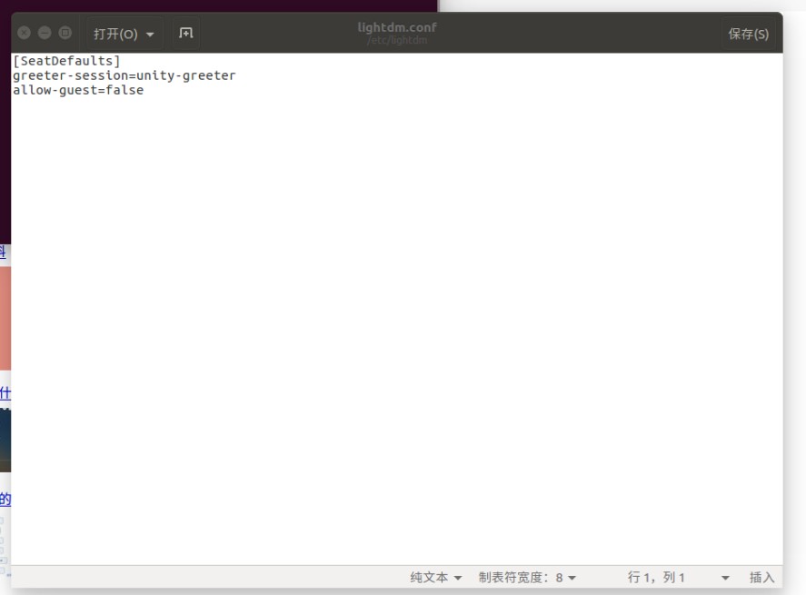

> 这是初次安装的时候，遇到的关于账户的两个问题。

### 1. 第一次设置root用户密码

> 刚安装好的Ubuntu是没有设置root密码的，只有一个账户和密码（自己设定的）。

- 在命令行里面，输入：`sudo passwd`。
- 输入当前用户密码
- 输入root密码（你要设置的）
- 再确定一次
- OK


### 2. 删除客人会话
> 不想在登陆的时候显示客人会话，这样会更安全，只有有密码和账户的用户才可以使用。

- 命令行输入:`sudo gedit /etc/lightdm/lightdm.conf`


- 打开后设置配置文件(配置如下)
```
[SeatDefaults]  
greeter-session=unity-greeter  
allow-guest=false  
```



- 再次打开就没有客人会话了

